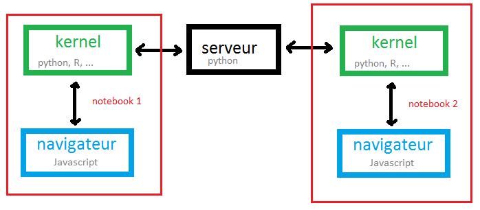

.. _l-javascript-principe-base-2a:

Javascript
==========

.. index:: asynchrone

Il ne s'agit pas ici de faire un cours sur le Javascript.
Pour cela, vous pouvez lire celui-ci :
`Cours de JavaScript - Bonnes pratiques de codage en javascript <http://www.gchagnon.fr/cours/dhtml/bonnespratiques.html#tablemat>`_.
La connaissance du langage Python permet de comprendre une bonne partie
des scripts écrit en Javascript. Les différences notables sont les suivantes :

* **Syntaxe :** les instructions sont séparées par des points-virgules.
  L'indentation ne joue aucun rôle. Les blocs d'instructions sont délimités
  par des accolades.
* **Page HTML :** le Javascript est soit exécuté par un serveur comme
  `node.js <https://nodejs.org/>`_ soit par un navigateur auquel cas il interagit avec
  une page HTML ou plus précisément le `DOM <https://en.wikipedia.org/wiki/Document_Object_Model>`_.
* **Asynchrone :** le langage a été pensé pour la programmation
  `asynchrone <http://sametmax.com/la-difference-entre-la-programmation-asynchrone-parallele-et-concurrente/>`_.
  La page HTML est affichée pendant que
  différents éléments sont ajoutés au fur et à mesure produits par des scripts javascripts
  exécutés de façon asynchrone.
  il est impossible de prédire lequel aboutira en premier.

Le javascript a pris beaucoup d'importance dans la conception des site web
et il est devenu le langage par excellente pour tous les graphes
interactifs.

Jupyter
+++++++

En résumé, Jupyter fonctionne comme ci :

Pour chaque nouveau notebook, un serveur écrit en python crée ce qu'on appelle un kernel
qui communique avec une page dans le navigateur. Le kernel peut être en n'importe quel langage.
Le navigateur interagit en javascript. L'action qu'il effectue le plus souvent
est l'envoie d'un script au kernel, il récupère les résultats qu'il insère dans la page
une fois l'exécution terminée.

Par défault, Jupyter considère que ce qu'il doit afficher est du texte brut.
Mais il est possible de préciser que celui-ci est du HTML ou du Javascript.
C'est cette possibilité que nous allons utilisée. Le notebook
`Notebook, HTML, SVG and Javacript <http://www.xavierdupre.fr/app/jyquickhelper/helpsphinx/notebooks/notebook_html_svg.html>`_
illustre l'ajout de `HTML <https://en.wikipedia.org/wiki/HTML>`_,
`SVG <https://en.wikipedia.org/wiki/Scalable_Vector_Graphics>`_ et
`Javascript <https://en.wikipedia.org/wiki/JavaScript>`_ dans un notebook.

Ajout de HTML et de SVG
+++++++++++++++++++++++

::

    from IPython.display import HTML, display
    display(HTML("<b>some blod text</b>")

Ce ménanisme est illustré dans le notebook
`Notebook, HTML, SVG and Javacript <http://www.xavierdupre.fr/app/jyquickhelper/helpsphinx/notebooks/notebook_html_svg.html>`_.

Ajout de Javascript
+++++++++++++++++++

Dans le cas d'une notebook, on souhaite presque toujours créer un graphe ou une animation
qui s'appuie sur du javascript. Cela se passe presque toujours de la même façon :

* On ajouter un container HTML vide au notebook : ``

``.
* Le javascript récupère le container et modifie son contenu.

Ce ménanisme est encore illustré dans le notebook
`Notebook, HTML, SVG and Javacript <http://www.xavierdupre.fr/app/jyquickhelper/helpsphinx/notebooks/notebook_html_svg.html>`_.

Utilisation de librairies Javascript
++++++++++++++++++++++++++++++++++++

* `Notebook, Graph and Javascript <http://www.xavierdupre.fr/app/jyquickhelper/helpsphinx/notebooks/notebook_graph_js.html>`_

Links
+++++

* :ref:`td2acenoncesession4Arst`
* :ref:`Python et Javascript <blog-post-flexx>`
