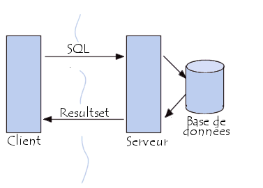
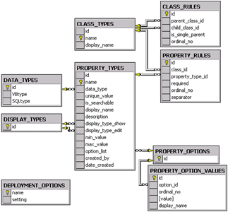
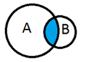
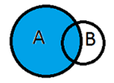
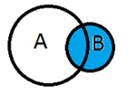
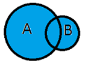

SQL, PRINCIPES DE BASE
======================
 
POURQUOI SQL A L'HEURE DU BIG DATA ?
++++++++++++++++++++++++++++++++++++

SQL vous en avez surement déjà entendu parler, vous en avez peut-être même déjà fait. 
SQL est un langage classique de management des données, très utilisé depuis les années 80. 
Un peu un langage à la papa. Pourquoi on s'y intéresse aujourd'hui alors 
qu'on est en train de parler Big Data, vitesse, volume et variété ?
Si Hadoop a été une révolution dans le stockage et l'accès aux données, 
il était néanmoins nécessaire de ne pas tout bouleverser d'un seul coup. 
Pour ne pas perdre les personnes qui travaillaient quotidiennement avec 
des bases de données, habitués au langage SQL, il a fallut s'adapter.
De fait, on a copié la syntaxe des commandes SQL pour interroger 
les données conservées dans Hadoop.
Ce document propose une rapide introduction, circonscrite à avoir 
les quelques commandes qui vont servir à comprendre puis utiliser 
le langage SQL dans le framework Hadoop.
A la fin de ce document, vous saurez :

* Lire le SQL
* Quelle commande fait quoi
* Eventuellement écrire quelques commandes

Le but n'est évidemment pas que vous le parliez couramment. 
D'ailleurs il n'y a pas vraiment de TD, juste un exemple d'utilisation 
de SQL via Python. Essayez d'exécuter les différentes requêtes 
et vous aurez les bases indispensables à la formation Hadoop.

INTRODUCTION
++++++++++++

QU'EST-CE QUE C'EST ?
^^^^^^^^^^^^^^^^^^^^^

Le langage SQL (Structured Query Language) est un langage très simple de 

* définition
* manipulation et
* contrôle des données

C'est un langage de management de données, pas de nettoyage, 
d'analyse ou de statistiques avancées.
Grâce au langage SQL, il est possible de communiquer avec un 
**système de gestion des bases de données** (SGBD) qui est une 
passerelle entre l'utilisateur et les **bases de données**.
Dans ce contexte précis, on parle de base de données comme 
d'un système de tables reliées entre elles et organisées de manière à éviter au 
maximum la redondance d'informations et à faciliter la manipulation de données 
parfois très volumineuses.
De manière synthétique, quand l'utilisateur formule une requête SQL 
- un ensemble d'ordres - elle est envoyée à un SGBD pour manipuler 
et récupérer des informations d'une base de données.

 
Le langage SQL est commun à une grande majorité les systèmes de 
gestion de base de données (Microsoft Access, Oracle...). 
Grâce à lui, on peut accéder aux différentes informations que 
recèle notre base de données. Ces informations sont disséminées 
dans différentes tables et le but de SQL est de vous permettre 
d'accéder aux informations que vous recherchez.

UN EXEMPLE PRATIQUE DE BASE DE DONNEES
^^^^^^^^^^^^^^^^^^^^^^^^^^^^^^^^^^^^^^

Dans le schéma ci-dessous, les tables (CLASS_RULES, CLASS_TYPES, ...) 
composent la base de données. Les flèches entre les tables sont 
les relations, c'est ce qui permet de faire des liens entre les tables. 
Enfin les symboles "clés" représentent la clé de chaque table : 
il s'agit d'identifiants uniques pour chaque individu de la table.

Le format des tables en SQL est très rigide. L'ensemble de valeurs d'un 
attribut est forcément d'un seul format, les nouvelles entrées 
doivent satisfaire les contraintes définies pour la colonne. 

COMMENT ON L'UTILISE ?
^^^^^^^^^^^^^^^^^^^^^^

Le SQL est un langage qu'on retrouve dans beaucoup de logiciels comme SAS 
ou Microsoft Access. On peut aussi l'utiliser via Python.
Il ne possède pas la puissance d'un langage de programmation : entrées/sorties, 
instructions conditionnelles, boucles etc.
Pour la plupart des traitements qui nous concernent, il est donc nécessaire 
de coupler le langage SQL avec un langage de programmation plus complet.

TERMES UTILISES EN SQL
^^^^^^^^^^^^^^^^^^^^^^

Avec les bases de données, il faut utiliser un vocabulaire précis. 
Alors on va commencer par un rapide lexique des principaux termes utilisés en SQL.

.. list-table::
    :widths: 5 10 10
    :header-rows: 1
    
    * - Terme
      - Définition
      - Exemple, remarques
    * - Attribut
      - Propriété d'une entité, correspondant généralement à la valeur 
        pour une colonne dans une table de la base.	
      - Attribut date de naissance d'une personne
    * - Table
      - Ensemble de données relatives à un même concept, ou permettant de 
        lier d'autres tables.
      - Table des clients, table des commandes
    * - Colonne
      - Élément vertical dans une table représentant un ensemble de 
        valeurs d'un attribut.
      - Colonne "Nom" de la table des clients, colonne "Mode de paiement" 
        de la table des commandes
    * - Ligne
      - Élément horizontal dans une table représentant une 
        énumération des valeurs des différents attributs (colonne) 
        pour une même référence (identifiant).
      - Ligne de référence N° de commande = 328 de la table commande
    * - Clef (Identifiant)
      - Identifiant d'une table composé d'un ou plusieurs attributs 
        ou colonne. Une clef permet de retrouver sans ambiguïté la 
        ligne dans une table. Les valeurs d'une clef doivent être 
        uniques au sein de la table.
      - Equivalent à l'index dans pandas
    * - Clef étrangère
      - Colonne, ou groupe de colonne représentant une clef d'une table, 
        insérée dans une autre table afin d'assurer la relation entre les 
        deux tables.
      - Le n° de client dans la table des commandes est une clef étrangère 
        dans cette table, et une clef primaire dans la table des clients
    * - Contrainte
      - Mécanisme de contrôle de validité des données interdisant l'insertion 
        de données violant les contraintes.
      - Contrainte d'intégrité 
        référentielle, contrainte minimum et maximum, obligation de 
        valeur (interdiction d'insertion de données indéfinies)
    * - **Violation (de contrainte, de clef)**
      - Erreur générée lorsque l'on tente d'insérer une ligne avec 
        une valeur de clef déjà utilisée (violation de clef), 
        ou pour des valeurs de colonne hors des contraintes définies 
        (violation de contrainte).
      - L'insertion d'une commande avec le n° de commande 328 sera 
        rejetée si la commande d'identifiant 328 existe déjà 
        dans la table des commandes
    * - Relation
      - Lien logique entre deux entités, représenté dans l'univers des 
        SGBDR par l'insertion d'une clef étrangère ou par l'utilisation 
        d'une table de jointure.
      - La relation entre les tables "client" et "commande" se fait 
        par une table de jointure possédant comme clef, l'ensemble des 
        colonnes relatives aux deux clefs des deux tables
    * - Index
      - Construction physique d'une structure de données relative à 
        une ou plusieurs colonnes d'une table, permettant d'accélérer 
        les recherches au sein d'une table.
      - En principe, les SGBDR 
        construisent des index pour les colonnes définissant la clef 
        de la table et chacune des clefs étrangères.
    * - Ordre
      - Construction littérale dont la syntaxe répond aux spécificités 
        du SQL et qui intime au moteur de la base de données d'effectuer 
        tel ou tel travail.
      - Dans la norme SQL l'ordre d'insertion de 
        données commence par le mot clef INSERT
    * - Clause
      - Partie d'un ordre SQL précisant un fonctionnement particulier
      - La clause ORDER BY est la dernière clause de tout ordre SQL et 
        ne doit figurer qu'une seule fois dans le SELECT
    * - Prédicat
      - Construction logique dont la valeur peut être évaluée à vrai ou faux.
      - La phrase suivante "la couleur de la voiture du président de la 
        république est jaune" peut être évaluée logiquement à vrai ou faux
        
LES ORDRES
++++++++++

Les ordres (cf. dico !) de manipulation de données ont des syntaxes particulières. 
Elles sont détaillées dans cette partie.

LA SELECTION AVEC SELECT
^^^^^^^^^^^^^^^^^^^^^^^^

L'ordre ``SQL SELECT`` est composé de 7 clauses dont 5 sont optionnelles (en violet) : 

::

    SELECT { * | attributs [ AS nom_affiché ] } 
    FROM nom_table [ [ AS ] alias] [, ...]]
    [ [ WHERE predicat] ]
    [ [ GROUP BY expression [, ...]]
    [ [ HAVING condition [, ...]]
    [ [ UNION | INTERSECT | EXCEPT [ [ALL] ALL]} requête ]
    [ [ ORDER BY expression [ASC | DESC]  [, ...]]

 
``SELECT``

Cette clause permet de spécifier les attributs que l'on désire 
voir apparaître dans le résultat de la requête par exemple ``'Nom'``
ou ``*`` si on souhaite avoir tous les attributs des tables.

``FROM``

Cette clause spécifie les tables sur lesquelles porte la requête.

``WHERE``

Cette clause permet de filtrer les n-uplets en imposant une condition 
à remplir pour qu'ils soient présents dans le résultat de la requête.
Exemples : 

* ``expr IS NULL`` : pour tester l'indétermination de expr
* ``expr IN (expr_1 [...])`` : pour test la présence de expr dans une liste de valeurs

``GROUP BY``

Cette clause permet de définir des groupes.

``HAVING``

Cette clause permet de spécifier un filtre portant sur les résultats.

``HAVING SUM(NB_COMMANDES) >= 20``

``UNION, INTERSECT et EXCEPT``

Cette clause permet d'effectuer des opérations ensemblistes entre plusieurs 
résultats de requête (i.e.entre plusieurs ``SELECT``).

``ORDER BY``

Cette clause permet de trier les n-uplets du résultat.
Elle permet de trier le résultat final de la requête, 
elle est donc la dernière clause de tout ordre SQL et ne doit figurer 
qu'une seule fois dans le ``SELECT``, 
même s'il existe des requêtes imbriquées ou un jeu de requêtes ensemblistes.

LA MISE A JOUR DES TABLES
^^^^^^^^^^^^^^^^^^^^^^^^^

Les ordres  qui sont définis par ``INSERT``, ``UPDATE`` ou ``DELETE`` 
sont appelés des règles de mise à jour. Ils servent à enrichir les tables.

**INSERT : 2 MANIERES DE FAIRE**

*Insérer une ligne en donnant les valeurs*

L'ordre ``INSERT`` permet d'insérer une ligne dans une table 
en spécifiant les valeurs à insérer. La syntaxe est la suivante :

::

    INSERT INTO nom_table(nom_col_1, nom_col_2, ...)
    VALUES (val_1, val_2, ...)

 
La liste des noms de colonne est optionnelle. Si elle est omise, la 
liste des colonnes sera par défaut la liste de l'ensemble des colonnes 
de la table dans l'ordre de la création de la table. Si une liste de 
colonnes est spécifiée, les colonnes ne figurant pas dans la liste 
auront la valeur ``NULL``.

*Insérer des lignes à partir d'une autre table*

Il est possible d'insérer dans une table des lignes provenant d'une 
autre table grâce à un ordre SELECT. La syntaxe est la suivante :

::

    INSERT INTO nom_table(nom_col1, nom_col2, ...)
    SELECT ...
 
**UPDATE**

La commande ``UPDATE`` permet de modifier les valeurs d'une 
ou plusieurs colonnes, dans une ou plusieurs lignes existantes d
'une table. La syntaxe est la suivante :

::

    UPDATE nom_table
    SET nom_col_1 = {expression_1 ou avec ( SELECT ...) }, 
        nom_col_2 = {expression_2 ou avec ( SELECT ...) },
        ...
        nom_col_n = {expression_n ou avec ( SELECT ...) }
    WHERE predicat

**DELETE**

La commande ``DELETE`` permet de supprimer des lignes d'une table.

::

    DELETE FROM nom_table
    WHERE predicat

 
 
LES JOINTURES
^^^^^^^^^^^^^

Les jointures en SQL permettent d'associer plusieurs tables dans une même requête. 
On distingue quatre types de jointure qui correspondent aux différents cas proposés 
par la colonne _merge créée par STATA après un merge.

**INNER**

On garde tous les appariements réussis (équivalent STATA : keep if _merge == 3)

::

    SELECT *
    FROM A
    INNER JOIN B ON A.id = B.autreid
    

**LEFT**

On garde tous les appariements réussis et les lignes 
non appariées de la table de gauche (équivalent STATA : keep if _merge != 2)

:: 

    SELECT *
    FROM A
    LEFT JOIN B ON A.id = B.autreid

 
Si on ne veut garder que les lignes de A qui n'ont pas mergé il faut ajouter :

::

    WHERE id IS NULL    
 
**RIGHT**

On garde tous les appariements réussis et les lignes non appariées 
de la table de droite (équivalent STATA : keep if _merge != 1)

**OUTER**

On garde tous les appariements réussis et les lignes non appariées des deux tables.

LES FONCTIONS D'AGREGATION
^^^^^^^^^^^^^^^^^^^^^^^^^^

Les fonctions d'agrégation dans le langage SQL permettent 
d'effectuer des opérations statistiques sur un ensemble d'enregistrements.

* ``COUNT( * | [DISTINCT | ALL] expression)``
* ``AVG( [ DISTINCT | ALL ] expression)``
* ``MAX( [ DISTINCT | ALL ] expression)``
* ``MIN([ DISTINCT | ALL ] expression)``
* ``STDDEV([ DISTINCT | ALL ] expression)``
* ``SUM([ DISTINCT | ALL ] expression)``
* ``VARIANCE([ DISTINCT | ALL ] expression)``

Si expression est présent, on ne compte que les lignes pour 
lesquelles cette expression n'est pas NULL.

* ``DISTINCT`` indique à la fonction de groupe de ne prendre en compte 
  que des valeurs distinctes.
* ``ALL`` indique à la fonction de groupe de prendre en compte toutes 
  les valeurs, c'est la valeur par défaut.
  
Aucune des fonctions de groupe ne tient compte des valeurs 
``NULL`` à l'exception de ``COUNT(*)``. 
Ainsi, ``SUM(col)`` est la somme des valeurs non ``NULL`` de la colonne *col*. *
De même ``AVG`` est la somme des valeurs non ``NULL`` divisée par le 
nombre de valeurs non ``NULL``.

Il est tout à fait possible d'utiliser des fonctions d'agrégation 
sans clause ``GROUP BY``. Dans ce cas, la clause ``SELECT`` ne doit 
comporter que des fonctions d'agrégation et aucun nom de colonne. 
Le résultat d'une telle requête ne contient qu'une ligne.
Cet ordre donne pour chaque client le nombre d'enregistrements, 
le min et le max du prix.

::

    SELECT client, COUNT(*), MIN(prix), MAX(prix) 
    FROM commandes 
    GROUP BY client

 

