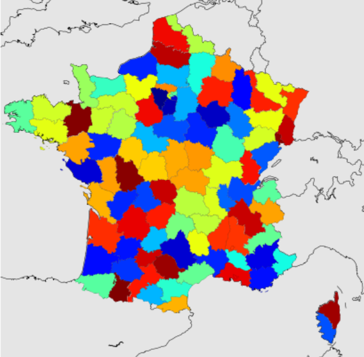

.. image:: pyeco.png
    :height: 20
    :alt: Economie
    :target: http://www.xavierdupre.fr/app/ensae_teaching_cs/helpsphinx3/td_2a_notions.html#pour-un-profil-plutot-economiste

.. image:: pystat.png
    :height: 20
    :alt: Statistique
    :target: http://www.xavierdupre.fr/app/ensae_teaching_cs/helpsphinx3/td_2a_notions.html#pour-un-profil-plutot-data-scientist

.. _l-py2a-cartes:

Cartes
++++++

.. index:: carte

Les cartes ne sont jamais aussi simples qu'elles en ont l'air,
que ce soit en :epkg:`Python` ou un autre langage. La première
des tâches consiste à récupérer le décor : départements,
régions, frontières, rivières. Les frontières des pays
sont souvent disponibles avec peu d'efforts mais dès qu'il s'agit
d'une granularité plus fine, il faut récupérer des données
comme `Contours des EPCI 2013 <https://www.data.gouv.fr/fr/datasets/contours-des-epci-2013/>`_.
Ces contours sont décrits sous la forme de
`shapefile <https://fr.wikipedia.org/wiki/Shapefile>`_.
Chaque pays a souvent son propre système de coordonnées et il faut
convertir les coordonnées dans un même système,
`longitude, latitude <https://fr.wikipedia.org/wiki/Coordonn%C3%A9es_g%C3%A9ographiques>`_
le plus souvent. Le module :epkg:`pyproj` vient aider à cela.
Une fois qu'on a tous les éléments, on peut commencer à tracer la carte
ce qui revient à convertir les coordonnées *latitude, longitude*
dans un repère *x, y*, ce que fait un module comme :epkg:`basemap`.

Et puis on s'aperçoit parfois que cette représentation figée
ne suffit pas et qu'il faut à la fois avoir une vue d'ensemble
et pouvoir zoomer sur une zone en particulier. On utilise
alors le :epkg:`javascript` avec :epkg:`bokeh`. Et puis, parfois,
on ne veut pas seulement quelques détails mais tous les détails
d'une carte comme les routes, les villes ou les villages. Le plus simple
est alors de projeter des points sur des systèmes de cartes
comme :epkg:`OpenStreetMap` avec le module
:epkg:`folium`. Enfin, peut-être qu'on n'a pas envie
de vouloir connaître tous ces modules et d'avoir une interface
unique, c'est ce vers quoi tend le module :epkg:`geopandas`.

*Notebooks*

* :ref:`td1acenoncesession12rst`
* :ref:`td1acorrectionsession12rst`
* `Evolution d'une population <http://www.xavierdupre.fr/app/actuariat_python/helpsphinx/notebooks/seance4_projection_population_enonce.html>`_
* `Evolution d'une population - correction <http://www.xavierdupre.fr/app/actuariat_python/helpsphinx/notebooks/seance6_graphes_correction.html>`_

*Formats de données*

* :ref:`Système de coordonnées <blog-donnees-carroyees-2016>` (et données carroyées)
* format de cartes
  `shapefiles <https://en.wikipedia.org/wiki/Shapefile>`_,
  `topoJSON <https://en.wikipedia.org/wiki/GeoJSON#TopoJSON>`_,
  `geoJSON <https://en.wikipedia.org/wiki/GeoJSON>`_,
* `Projections sphériques et conversion <http://www.xavierdupre.fr/app/ensae_projects/helpsphinx/notebooks/chsh_geo.html>`_
* conversion de coordonnées en longitude / latitude
* librairies
  `basemap <http://matplotlib.org/basemap/>`_, ...
* sources :
  `DataMaps <http://datamaps.github.io/>`_,
  `Find Data <https://bost.ocks.org/mike/map/#finding-data>`_

*Modules*

* `cartopy <http://scitools.org.uk/cartopy/>`_
* `pyshp <https://pypi.python.org/pypi/pyshp>`_
* `shapely <https://pypi.python.org/pypi/Shapely>`_
* `pyproj <https://pypi.python.org/pypi/pyproj>`_
* `geopy <https://pypi.python.org/pypi/geopy>`_
* `basemap <http://matplotlib.org/basemap/>`_
  (maintenu jusqu'en 2020, il faut préférer `cartopy <http://scitools.org.uk/cartopy/>`_)
* `geoviews <http://geo.holoviews.org/Geometries.html>`_
* `geopandas <http://geopandas.org/>`_

*Modules avec Open Street Map*

* `ipyleaflet <https://github.com/ellisonbg/ipyleaflet>`_
* `folium <https://github.com/python-visualization/folium>`_
