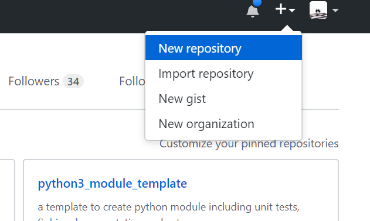
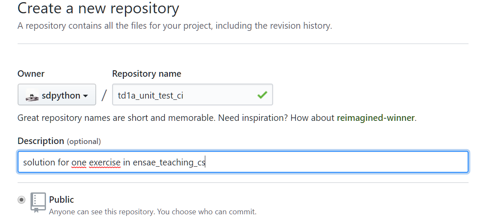
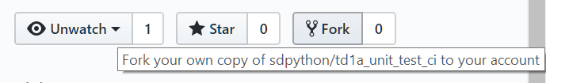
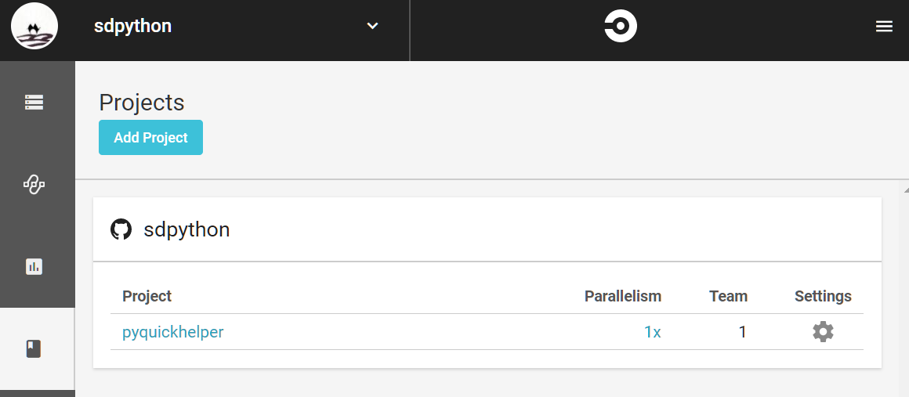
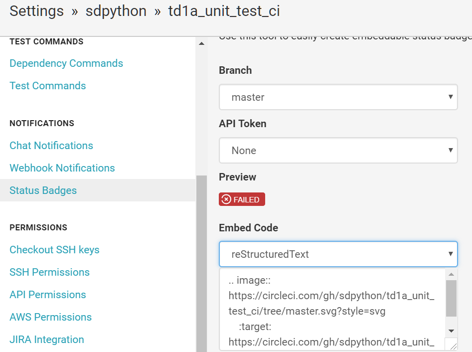

.. _td1aunittestcicorrectionrst:

******************************************************************
1A.soft Tests unitaires, setup et ingéniérie logiciel (correction)
******************************************************************

Ce notebook donne des éléments de réponses pour
:ref:`td1aunittestcirst`. Le code source peut-être
trouvé sur :epkg:`GitHub`:
`td1a_unit_test_ci <https://github.com/sdpython/td1a_unit_test_ci>`_.

.. contents::
    :local:

Ecrire une fonction
-------------------

.. runpython::
    :showcode:

    def solve_polynom(a, b, c):
        if a == 0:
            # One degree.
            return (-c/b, )
        det = b*b - (4*a*c)
        if det < 0:
            # No real solution.
            return None

        det = det ** 0.5
        x1 = (b - det) / (2 * a)
        x2 = (b + det) / (2 * a)
        return x1, x2

    print(solve_polynom(1, 1, -1))

Ecrire un test unitaire
-----------------------

::

    import unittest
    from polynom import solve_polynom

    class TestPolynom(unittest.TestCase):
        """
        The class tests the three possible cases.
        Another one is still not tested...
        """

        def test_solve_polynom(self):
            x1, x2 = solve_polynom(1, 0, -4)
            self.assertEqual((x1, x2), (-2, 2))

        def test_solve_polynom_linear(self):
            x1 = solve_polynom(0, 1, -4)
            self.assertEqual(x1, (4,))

        def test_solve_polynom_no_soolution(self):
            x1 = solve_polynom(1, 1, 4)
            self.assertEqual(x1, None)

    if __name__ == '__main__':
        unittest.main()

On peut lancer le test unitaire depuis la ligne de commande.

::

    python -m unittest test_polynom.py

Ou tout simplement pour exécuter tous les fichiers de tests :

::

    python -m unittest

Couverture ou coverage
----------------------

On utilise le module `coverage <https://coverage.readthedocs.io/>`_ qui
se résume à une ligne de commande.

::

    coverage run -m unittest

Un fichier `.coverage` apparaît. Ce sont des données brutes
plus facilement lisible après leur conversion en un rapport de couverture.

::

    coverage report -m

Ce qui donne :

::

    Name              Stmts   Miss  Cover   Missing
    -----------------------------------------------
    polynom.py           10      0   100%
    test_polynom.py      14      1    93%   29
    -----------------------------------------------
    TOTAL                24      1    96%

Ou alors au format html:

::

    coverage html -d coverage.html

Ce qui donne `coverage.html/index.html <coverage.html/index.html>`_.

Créer un compte GitHub
----------------------

A suivre par image. Tout d'abord sur le site de
:epkg:`GitHub`, on crée un nouveau *repository* :

Puis depuis l'application
`Github Desktop <https://desktop.github.com/>`_ où on clone
le *repository*.

.. image:: screens/cighd1.png

Cela correspond au *repository* :
`td1a_unit_test_ci <https://github.com/sdpython/td1a_unit_test_ci>`_.

**Le principe :**

:epkg:`GitHub` est ce qu'on appelle un
`emplacement remote <https://git-scm.com/book/en/v2/Git-Basics-Working-with-Remotes>`_.
:epkg:`GitHub` est comme un serveur :epkg:`git`, il détient l'intégralité
des fichiers du projet ce lequel on travaille. Il garde l'historique des modifications
apportées à ce projet.
Une copie locale est crée lorsqu'on
`clone <https://git-scm.com/book/en/v2/Git-Basics-Getting-a-Git-Repository>`_.
Dès lors, on passe son temps à soit envoyer au *remote repository* ses modifications
locales soit récupérer les modifications des autres développeurs apportées au
*remote repository*. Quelques repères et conventions :

* `README.rst <https://github.com/sdpython/td1a_unit_test_ci/blob/master/README.rst>`_ :
  le fichier résume le projet.
* `.gitignore <https://github.com/sdpython/td1a_unit_test_ci/blob/master/.gitignore>`_ :
  ce fichier indique quels fichier ne doivent pas être pris en compte dans le
  *repository*. Ce sont principalement des fichiers créés lors de la compilation
  ou par le programme lui-même. Les stocker n'est pas utile puisqu'ils
  sont créés par le programme qu'on développe.
* `LICENSE.rst <https://github.com/sdpython/td1a_unit_test_ci/blob/master/LICENSE.txt>`_ :
  la licence détermine la façon dont vous souhaitez que votre travail soit utilisé.
  Ici, c'est la licence `MIT <https://en.wikipedia.org/wiki/MIT_License>`_. Elle stipule
  simplement que ce code peut être modifié ou réutilisé par quiconque à condition
  que cette licence y soit incluse afin de préciser l'auteur.

La page `commit <https://github.com/sdpython/td1a_unit_test_ci/commits/master>`_ garde la
trace des modifications. Pour contribuer à ce projet, il faut d'abord le rapatrier sur son
propre compte :epkg:`GitHub` en le `forkant <https://fr.wikipedia.org/wiki/Fork_(d%C3%A9veloppement_logiciel)>`_.

Intégration continue
--------------------

`travis <https://travis-ci.org/>`_ est un des plus simples.
Nous allons essayer `circleci <https://circleci.com/>`_.
Il fonctionne comme tous les autres.
Il faut d'abord créer un compte.
On ajoute le projet à la liste de ceux qu'il faut exécuter
de façon régulière.

.. image:: screens/cicircle1.png

On suit les instructions et on crée un fichier de configuration ``.circleci/config.yml``
qui précise la commande à lancer pour exécuter les tests unitaires.
Le fichier ``config.yml`` précise la version de
:epkg:`Python` à utiliser. Il peut y en avoir plusieurs.
On spécifie les modules à installer dans le fichier ``requirements.txt``
(qui ne contient que la ligne ``coverage``) puis
la commande à exécuter :

::

    version: 2
    jobs:
      build:
        docker:
          - image: circleci/python:3.6.1

        working_directory: ~/repo

        steps:
          - checkout

          - restore_cache:
              keys:
              - v1-dependencies-{{ checksum "requirements.txt" }}
              - v1-dependencies-

          - run:
              name: install dependencies
              command: |
                python3 -m venv venv
                . venv/bin/activate
                pip install -r requirements.txt

          - save_cache:
              paths:
                - ./venv
              key: v1-dependencies-{{ checksum "requirements.txt" }}

          - run:
              name: run tests
              command: |
                . venv/bin/activate
                python -m unittest

          - store_artifacts:
              path: test-reports
              destination: test-reports

Le résultat est disponible à
`circleci/td1a_unit_test_ci <https://circleci.com/gh/sdpython/td1a_unit_test_ci>`_.
Le site génère une image pour indiquer le statut de la dernière exécution.

Et on l'insère dans le fichier `README.rst`:

::

    .. image:: https://circleci.com/gh/sdpython/td1a_unit_test_ci/tree/master.svg?style=svg
        :target: https://circleci.com/gh/sdpython/td1a_unit_test_ci/tree/master

Le résultat est tout de suite visible sur `GitHub <https://github.com/sdpython/td1a_unit_test_ci>`_.
Le `dashboard <https://circleci.com/dashboard>`_ résume les résultats
des dernières exécution de tous les projets. On ajoute une ligne pour
produire le rapport de couverture :
`commit add coverage <https://github.com/sdpython/td1a_unit_test_ci/commit/28c19b1d3c0abf21519fc0f9835ce0c5b027cd24>`_.
Ce changement crée le rapport de couverture dans un endroit spécifique appellé *artifacts*
et *circleci* conserve tout ce qui copié dans ce répertoire. On peut alors
les consulter.

.. image:: screens/cicircle4.png

Ecrire un setup
---------------

Le setup permet de construire un fichier de telle sorte qu'un autre
utilisateur pourra utiliser le module en l'installant avec
`pip <https://pip.pypa.io/en/latest/>`_ :

::

    pip install td1a_unit_test_ci

Le setup est assez court et toujours dans un fichier ``setup.py``.
C'est le plus souvent un copier/coller. On déplace également le code
de façon à avoir un répertoire de source et un de test. On ajoute également
un fichier ``__init__.py`` vide pour signifer que c'est un module
ce que le setup découvrira automatiquement grâce à la fonction
`find-packages <http://setuptools.readthedocs.io/en/latest/setuptools.html#using-find-packages>`_.
On crée un package ``.tar.gz`` qui contient l'ensemble des sources avec l'instruction :

::

    python setup.py sdist

On crée un fichier ``.whl`` qui ne contient que les fichiers sources avec l'instruction :

::

    python setup.py bdist_wheel

Pour créer un *wheel*, il faut installer le package
`wheel <https://pypi.python.org/pypi/wheel>`_ et l'ajouter aux dépendances du build.
Ceci est résumé dans le commit
`move source for the setup <https://github.com/sdpython/td1a_unit_test_ci/commit/8347a7c247e05050999f4d67aa98856657412a1d>`_.
Il reste à mettre à jour la configuration de l'intégration continue
et ses changements sont visibles dans les commits suivants.
Le build fait maintenant partie des artifacts et chaque version du module
peut être installée.

Ecrire la documentation
-----------------------

L'outil le plus utilisé pour écrire la documentation d'un module est
`Sphinx <http://www.sphinx-doc.org/en/stable/>`_. Il reprend
la documentation de chaque fonction pour en faire un site HTML,
un document PDF. Il requiert l'installation de dépendences
telles que :epkg:`MiKTeX`, :epkg:`pandoc`, :epkg:`InkScape`
pour faire inclure des formules de mathématiques ou des documents PDF.
Il faut lire la documentation du site pour apprendre la syntaxe
`ReST <https://thomas-cokelaer.info/tutorials/sphinx/rest_syntax.html>`_.
Dans l'immédiat, on commence avec une documentation quasi vide
dans le répertoire ``doc`` et
`sphinx-quickstart <http://www.sphinx-doc.org/en/stable/tutorial.html>`_.

::

    sphinx-quickstart

Il suffit de répondre à une batterie de question pour confgurer le projet.
Après quelques modifications, j'ai abouti aux modifications suivantes :
`commit sphinx configuration <https://github.com/sdpython/td1a_unit_test_ci/commit/172c7b0ac21ecbd119733d98a3065826276b5018>`_.
Et quand tout est fini, il faut exécuter :

::

    sphinx-build -M html doc build

Et on obtient :

::

    Running Sphinx v1.6.3
    loading translations [fr]... done
    loading pickled environment... not yet created
    loading intersphinx inventory from https://docs.python.org/objects.inv...
    intersphinx inventory has moved: https://docs.python.org/objects.inv -> https://docs.python.org/2/objects.inv
    building [mo]: targets for 0 po files that are out of date
    building [html]: targets for 1 source files that are out of date
    updating environment: 1 added, 0 changed, 0 removed
    reading sources... [100%] index
    looking for now-outdated files... none found
    pickling environment... done
    checking consistency... done
    preparing documents... done
    writing output... [100%] index
    generating indices... genindex
    writing additional pages... search
    copying static files... done
    copying extra files... done
    dumping search index in French (code: fr) ... done
    dumping object inventory... done
    build succeeded.

Le thème le plus courant pour la documentation d'un module :epkg:`Python` est
`readthedocs <http://docs.readthedocs.io/en/latest/getting_started.html>`_.
On le change avec les `instructions de configuration <https://github.com/rtfd/sphinx_rtd_theme>`_.
Voir `commit change sphinx theme <https://github.com/sdpython/td1a_unit_test_ci/commit/6d8eca2a691549ea8f2ddb443abe16a784b2f2b4>`_.

Il reste à ajouter une page sur le fichier qui contient l'unique
module de l'extension ce qu'on fait avec l'instruction
`automodule <http://www.sphinx-doc.org/en/stable/ext/autodoc.html>`_.
Voir `commit add module polynom into the documentation <https://github.com/sdpython/td1a_unit_test_ci/commit/c207bd41305591794bf36dc2dde86f228144b3b2>`_.
Il ne reste plus qu'à ajouter ces instructions au process d'intégration continue :
`commit add documentation to circleci <https://github.com/sdpython/td1a_unit_test_ci/commit/11b0702a27fbcfa131c52997d0f0c5793c9590f7>`_.
Le dernier commit divise l'unique commande en plusieurs afin que cela soit plus
visible sur le site de *circleci*.
Voir `commit split circleci commands <https://github.com/sdpython/td1a_unit_test_ci/commit/4a2ccd9727d2082050420f6453724e52d8bbd9a7>`_.

Coding Style
------------

Le style est le genre de querelles sans fin où les développeurs
s'écharpent à propos de la façon d'écrire le code le plus lisible
qui soit. Je ne vais pas ici décider du meilleur style pour deux raisons.
La première est que bien souvent chacun a son propre style.
La seconde est que le langage :epkg:`Python` a décidé de décrire un style
standard sous la forme de règles : `PEP8 <https://www.python.org/dev/peps/pep-0008/>`_
et que la grande majorité des développeurs les suit.
Le troisième est que je serais bien incapable de vous décrire ces règles
car je ne les connais pas. J'utilise un outil
qui modifie mon code afin qu'il suive ces règles :
`autopep8 <https://pypi.python.org/pypi/autopep8>`_.
Je l'applique à l'ensemble du répertoire :

::

    autopep8 --in-place --aggressive --aggressive --recursive .

Cela donne `commit applies autopep8 <https://github.com/sdpython/td1a_unit_test_ci/commit/c7ae602b997462aad201d2ca5e6c5723088509d5>`_.
Pour tester si le style est correct, on peut utiliser le module
`flake8 <https://pypi.python.org/pypi/flake8>`_.

::

    flake8

::

    .\doc\conf.py:12:1: E402 module level import not at top of file
    .\doc\conf.py:36:1: E402 module level import not at top of file
    .\td1a_unit_test_ci\__init__.py:1:1: E265 block comment should start with '# '

Il existe aussi des règles pour la documentation
`PEP 257 <https://www.python.org/dev/peps/pep-0257/>`_.
`docformatter <https://pypi.python.org/pypi/docformatter/0.8>`_
permet de formatter la documentation.

::

    docformatter -r -i td1a_unit_test_ci

Le module `pydocstyle <https://pypi.python.org/pypi/pydocstyle/>`_
vérifie que les règles sont respectées.

::

    pydocstring td1a_unit_test_ci

Un dernier module `unify <https://github.com/myint/unify>`_
unifie la façon dont les chaînes de caractères sont écrites,
plus souvent des ``'`` que des ``"``.

*Est-ce vraiment utile ?*

Oui pour deux raisons. La première est de rendre un programme plus lisible.
Peu à peu on s'habitue à un style. Un code est plus facile à lire si les mêmes
conventions sont appliquées. La seconde raison est liée à :epkg:`git`. Si tout le
monde suit les mêmes règles, cela minimise les différences entre un code
écrit par un développeur et le même code modifié par un autre.

Dernière étape : PyPi
---------------------

Pour soumettre sur `PyPi <https://pypi.python.org/pypi>`_, il faut d'abord s'enregister
sur le site, choisir un login et un mot de passe. Il faut ensuite créer le fichier
``.pypirc`` dans le répertoire utilisateur
(`variable d'environnement <https://fr.wikipedia.org/wiki/Variable_d%27environnement>`_
``USERPROFILE`` sous Windows, ``$HOME`` sous Linux). Vous pouvez aussi suivre les instructions
décrites sur `The .pypirc file <https://docs.python.org/3/distutils/packageindex.html#the-pypirc-file>`_.

::

    [distutils]
    index-servers =
      pypi

    [pypi]
    repository=https://pypi.python.org/pypi
    username=<login>
    password=<password>

Pour publier le package, il suffit d'exécuter la ligne de commande :

::

    python setup.py bdist_wheel upload

Il est également de publier la documentation avec :

::

    python setup.py upload_docs --upload-dir=doc/build

Agilité
-------

*open source / propriétaire*

Mettre les sources sur *GitHub* et *CircleCI* ne pose pas de problème
pour un projet open source. Pour un projet propriétaire,
il faut soit payer le service proposé par ces deux sites soit
installer soi-même le même type d'outils.
`GitLab <https://about.gitlab.com/>`_ est open source et peut être
installé en tant que serveur :epkg:`git`.
`Jenkins <https://jenkins.io/>`_ est très facile à installer
en locale et remplit les mêmes fonctions que *CircleCI*.

*travailler à plusieurs*

Dans ce cas, il est essentiel de comprendre le concept de
`branche <https://fr.wikipedia.org/wiki/Branche_(gestion_de_configuration)>`_.
Chaque développeur crée une branche pour effectuer ses modifications
puis soumet une `pull request <https://en.wikipedia.org/wiki/Distributed_version_control#Pull_requests>`_
lorsqu'il a terminé pour propager ses modifications dans la branche principale.
Il s'ensuit une `revue de code <https://fr.wikipedia.org/wiki/Revue_de_code>`_
où les auteurs principaux (ceux qui ont droit de modifier la branche principale)
argumentent telle ou telle partie du code, demandent des changements ou
approuvent.

*historique*

Il est d'usage de garder la trace des nouvelles fonctionnalités ajoutées
ou bugs fixés à chaque modification. Il est aisé alors
de communiquer sur les changements intervenus d'une version à la suivante.
C'est grâce à un historique comme `celui scikit-learn <http://scikit-learn.org/stable/whats_new.html>`_
que vous pouvez décider si cela résoud le problème qui vous occupe actuellement.

Prolongements
-------------

*dépendances internes*

Travailler à plusieurs, créer, fusionner des branches sur git
devient vite une tâche quotidienne. Les tests unitaires augmentent
la durée des tests et on se pose vite la question de continuer à développement
la librairie en un seul tenant ou à la diviser en deux ou trois parties
plus faciles à traiter indépendemment les unes des autres.
On un vient vite à créer un système de dépendances.
Cela veut dire entre autre maintenant un système de dépendance
interne, ce qu'on peut faire en :epkg:`Python` avec
`pypiserver <https://pypi.python.org/pypi/pypiserver>`_.

*tests de vitesse*

La version 3 du langage Python était beaucoup plus lente que la version 2.
C'est une des raisons qui fait que celle-ci perdure plus longtemps
qu'espéré. C'est pourquoi maintenant un site a été mis sur pied pour
évaluer la vitesse du langage sur une série de test
`Python Speed Center <https://speed.python.org/>`_. C'est sans doute
une chose à laquelle il faudra songer pour mesurer des améliorations
sur une grande variété de situations.
