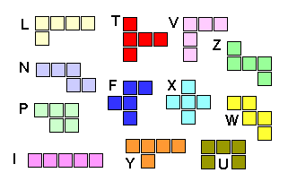
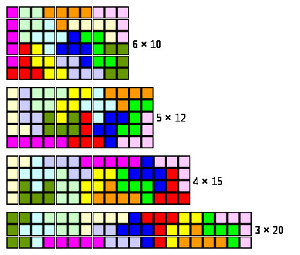


.. _l-proj_jeux_maths:

Jeux mathématiques
==================

Ces sujets reposent sur un exposé mathématique.

.. _l-math-wifi:

Ondes Wifi
----------

Tout tient dans cet article : `Helmhurts <http://jasmcole.com/2014/08/25/helmhurts/>`_.

.. _l-math-pento:

Pentomino
---------

.. index:: pentomino, tétris

Un pentomino est un puzzle style Tétris (voir la page `Wikipédia <http://fr.wikipedia.org/wiki/Pentamino>`_). 
Sur une grille, on doit disposer des pièces toutes différentes mais constituée d'un nombre fixe 
de carrés pour former un rectangle sans trous. 
Comment faire avec une méthode systématique ?

Vous pouvez soit vous lancer dans le vide, soit lire le document suivant `pentominoes.pdf <http://www.xavierdupre.fr/enseignement/projet_data/pentominoes.pdf>`_. 
Encore une fois, la résolution du puzzle constitue l'essentiel du projet, l'interface graphique 
est accessoire et la sortie pourrait tout-à-fait être réalisée en mode texte.

    

.. _l-math-motif:

Recherche exacte d'un motif, d'une expression
---------------------------------------------

.. index:: TF-IDF, BM25

L'objectif est assez simple puisqu'il s'agit de rechercher une expression, 
un mot dans toutes les pages Wikipédia. Néanmoins, rechercher une expression parmi 
plusieurs millions de pages est assez long et il est nécessaire d'optimiser 
les algorithmes utilisés 
(voir `Algorithme de recherche de sous-chaîne <http://fr.wikipedia.org/wiki/Algorithme_de_recherche_de_sous-cha%C3%AEne>`_ 
ou la `version anglaise <http://en.wikipedia.org/wiki/String_searching_algorithm>`_, 
plus complète). 
Dans un premier temps, on pourra comparer deux variantes parmi les cinq proposées :

* `Rabin–Karp algorithm <http://en.wikipedia.org/wiki/Rabin–Karp_string_search_algorithm>`_
* `Finite-state machine <http://en.wikipedia.org/wiki/Finite-state_machine>`_
* `Knuth–Morris–Pratt algorithm <http://en.wikipedia.org/wiki/Knuth–Morris–Pratt_algorithm>`_
* `Boyer–Moore string search algorithm <http://en.wikipedia.org/wiki/Boyer–Moore_string_search_algorithm>`_
* `Bitap algorithm <http://en.wikipedia.org/wiki/Bitap_algorithm>`_

Dans un second temps, on s'intéressera à la meilleure approche possible 
pour implémenter trois combinaisons logiques entre deux mots :

* Ce document doit contenir m1 et m2.
* Ce document doit contenir m1 ou m2.
* Ce document doit contenir m1 et m2 avec au plus n mots entre m1 et m2.

.. _l-math-exp:

Recherche approximative d'un motif, d'une expression
----------------------------------------------------

.. index:: Smith-Waterman, Approximate String Matching

Il arrive qu'on ne connaisse pas l'orthographe d'un mot qu'on cherche ou qu'on se 
trompe tout simplement et pourtant on souhaite toujours retrouver 
l'ensemble des documents Internet (ici Wikipedia seulement) 
qui contiennent une version approchée d'un mot ou d'une expression. 
La page `Approximate String Matching <http://en.wikipedia.org/wiki/Approximate_string_matching>`_ 
décrit le problème et donne quelques liens 
vers des solutions. Ces méthodes sont souvent utilisées pour la recherche 
de sous-séquences ADN et sont très coûteuses en calcul. 

Lorsque la séquence à chercher est courte, l'utilisation d'une 
`distance de Levenstein <http://en.wikipedia.org/wiki/Levenshtein_distance>`_
(voir également `Smith-Waterman <http://en.wikipedia.org/wiki/Smith%E2%80%93Waterman_algorithm>`_ 
ou encore `BLAST <http://en.wikipedia.org/wiki/BLAST>`_) 
améliorée est encore possible pour un temps de calcul raisonnable.

Lorsqu'on veut rechercher par exemple si un texte est largement inspiré d'une page Wikipédia, 
la chaîne est beaucoup plus longue et il faut ruser pour obtenir un temps de 
calculer raisonnable. On a recours à des 
`chaînes de Markov <http://ieeexplore.ieee.org/xpl/freeabs_all.jsp?arnumber=5715088>`_, 
ou des `q-grams <http://www.xavierdupre.fr/enseignement/projet_data/q-gram_TCS92.pdf>`_ 
(voir aussi `celui-ci <http://www.xavierdupre.fr/enseignement/projet_data/q-gram_p195-lee.pdf>`_). 
L'objectif n'est pas nécessairement d'utiliser ces méthodes mais de développer 
des idées simples permettant de rechercher un long texte dans le corps de Wikipedia. 

Saurez-vous ruser ?

.. _l-math-tsp:

Problème du voyageur de commerce
--------------------------------

.. index:: TSP, hill climbing, salesman, circuit hamiltonien, hamiltonien

C'est un problème assez classique : `problème du voyageur de commerce <http://fr.wikipedia.org/wiki/Probl%C3%A8me_du_voyageur_de_commerce>`_
qui consiste à trouver le plus court chemin passant par tous les noeuds d'un graphe. 
Le terme mathématique est : `circuit hamiltonien <http://fr.wikipedia.org/wiki/Graphe_hamiltonien>`_

On pourra essayer différents algorithmes :

* `Parcours eulériens et hamiltoniens <https://www.gerad.ca/~alainh/Euler-Hamilton.pdf>`_
* `Hill Climbing <http://en.wikipedia.org/wiki/Hill_climbing>`_
* `A New Algorithm For Finding Hamiltonian Ccircuits <http://www.dharwadker.org/hamilton/>`_
* `Trouver un cycle hamiltonien sur un graphe <http://blog.neamar.fr/2-uncategorised/129-algorithme-cycle-hamiltonien-graphe>`_

Exemple d'utilisation :

* `multiroute avec Bing <https://www.multiroute.de/?locale=fr>`_

.. _l-math-text:

Construction d'une texture
--------------------------

.. index:: image processing

On veut peindre une image à l'aide d'un motif présent sur une image plus petite. Le problème
survient lorsqu'on la duplique, en collant deux fois la même image côte à côte, les deux bords
s'ajustent rarement. L'article 
`Texture Synthesis by Non-parametric Sampling <http://www.xavierdupre.fr/enseignement/projet_data/texture_efros-iccv99.pdf>`_ 
propose une méthode pour contourner ce problème. 
On pourra aussi regarder le site des auteurs. L'objectif est
d'implémenter l'algorithme. Dans un deuxième temps, on pourra s'intéresser au même genre de méthode mais appliquer au
débruitage d'une image. On s'inspire pour cela de l'article 
`A Review Of Image Denoising Algorithms <http://www.xavierdupre.fr/enseignement/projet_data/debruitage_NLM_morel.pdf>`_
(chapitre 5). L'idée consiste à utiliser la redondance dans les images pour trouver dans
une partie non bruitée de l'image l'informatique cherchée.

* `Texture Synthesis by Non-parametric Sampling <http://www.xavierdupre.fr/enseignement/projet_data/texture_efros-iccv99.pdf>`_, Alexei A. Efros and Thomas K. Leung
* `Texture Synthesis by Non-parametric Sampling (web site) <http://graphics.cs.cmu.edu/people/efros/research/EfrosLeung.html>`_

.. _l-math_simulloi:

Simulation d'une loi statistique avec un algorithme d'optimisation A*
---------------------------------------------------------------------

L'objectif est d'implémenter l'algorithme décrit par l'article
`A* Sampling <http://papers.nips.cc/paper/5449-a-sampling.pdf>`_, Chris J. Maddison, Daniel Tarlow, Tom Minka.
