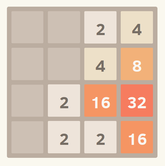


.. _l-proj_jeux_seul:

Jeux de réflexion qui se jouent seul
====================================

Pour chacun de ces projets, il faut imaginer un joueur artificiel. La qualité de 
l'affichage est secondaire et l'accent doit être mis avant tout sur les stratégies utilisées par 
ce joueur. Le projet ne peut être validé que si : 

* Le jeu se déroule sans intervention humaine.
* Il est possible de choisir parmi au moins deux stratégies (il peut 
  s'agir de la même stratégie avec différents paramètres). 
  
Le plan suggéré est le suivant : 

1. Implémentation des règles du jeu et d'un affichage (graphique ou texte). L'encadrant pourra 
   aider si cet affichage n'est pas terminé avant la mi-parcours. 
2. Conception de deux stratégies 
3. Sélection de la meilleure. 
   
Le modèle classique pour concevoir une stratégie consiste à utiliser une fonction d'évaluation qui 
donne un score à chaque coup possible. On choisit ensuite le coup qui maximise le score.
Avant de commencer la partie graphique, je suggère la lecture de cet article : 
`Frameworks for games in Python <http://www.xavierdupre.fr/blog/2014-01-01_nojs.html>`_.

2048
----

Ce jeu est devenu très populaire à sa sortie en février 2014. Il s'agit d'empiler des tuiles pour former
le nombre 2048. Les tuiles ne peuvent s'empiler que si elles sont égales. On veut ici implémenter une stratégie gagnante
puis mesurer différents indicateurs comme le taux de réussite ou le plus grand nombre auquel cette stratégie
puisse aboutir. Par exemple, existe-t-il des stratégies dont le taux de réussite est moins grand mais qui 
aboutisse plus fréquemment à des nombres plus grands que 2048 ?

Quelques liens : 

* `2048 <http://fr.wikipedia.org/wiki/2048_(jeu_vid%C3%A9o)>`_
* `2048 : la solution pour gagner (presque) à tous les coups <http://www.journaldunet.com/ebusiness/internet-mobile/solution-2048.shtml>`_

