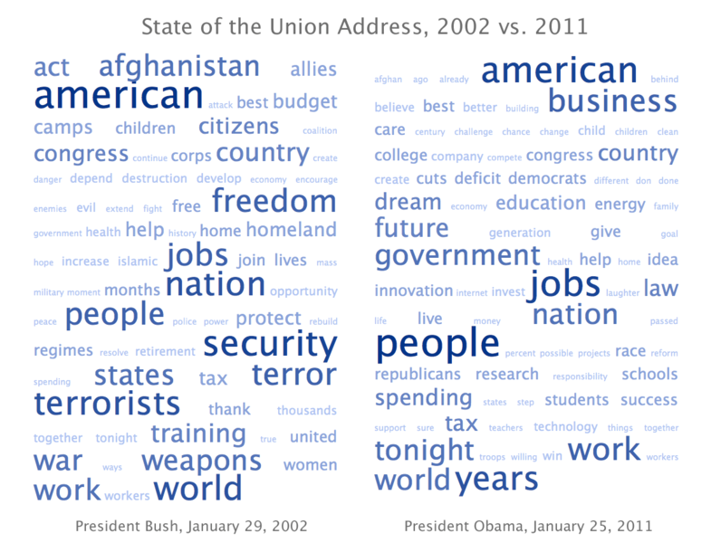


.. _l-proj_data:

Data en folie
=============

Il est difficile de résumer les sujets de cette rubrique.
Il s'agit toujours de triturer des données de différentes façons,
machine learning, datamining, recherche opérationnelle, texte mining...

Les sujets
----------

Inférer les trajectoirs de vélo vélib
+++++++++++++++++++++++++++++++++++++

C'était le sujet de la première coding party que personne
n'est vraiment arrivé à conclure. Avec un peu plus de temps, qui sait ?

:ref:`l-codingparty1`

Nuages de mots
++++++++++++++

Les nuages de mots sont apparus récemment pour représenter les mots-clés les plus importants sur une page, 
un ensemble de pages internet : `Tag Cloud <http://en.wikipedia.org/wiki/Tag_cloud>`_.

L'objectif est de construire ces nuages de points pour les discours du premier ministre et 
du président de la République. Le rendu graphique peut être réalisé simplement 
à partir du langage HTML (voir l'`exemple suivant <http://www.xavierdupre.fr/enseignement/projet_data/tag_cloud.html>`_) 
ou en utilisant des représentations dynamiques 
(voir `More about interactive graphs using Python, d3.js, R, shiny, IPython, vincent, d3py, python-nvd3 <http://www.xavierdupre.fr/blog/2013-11-30_nojs.html>`_).
Pour déterminer l'importance des termes, les premiers essais pourront être faits en fonction 
de la fréquence de chaque mot bien que cette méthode a tendance à favoriser les petits mots. 
On pourra ensuite utiliser des critères plus complexes comme celles suggérées sur la page 
`Tag Cloud <http://en.wikipedia.org/wiki/Tag_cloud>`_.

Quelques références bibliographiques :

- `REPRÉSENTATIONS DU TEXTE POUR LA CLASSIFICATION ARBORÉE <http://www.xavierdupre.fr/enseignement/projet_data/texte_n187r1340_mellet_co.pdf>`_
- `Tag Clusters as Information Retrieval Interfaces <http://www.xavierdupre.fr/enseignement/projet_data/texte_tag_cloud_Knautz_Soubusta_Stock.pdf>`_
- `Sur la topologie d'un arbre phylogénétique... <http://www.xavierdupre.fr/enseignement/projet_data/texte_topo_MSH_1987__100__57_0.pdf>`_

Deux blogs qui pourront vous donner d'autres idées comme calculer la richesse d'un vocabulaire :

- http://pascal-marchand.fr/spip.php?article13
- http://corpus.revues.org/index52.html

Si besoin, voici d'autres données sur un autre blog :

- http://sites.univ-provence.fr/veronis/Discours2007/
- http://sites.univ-provence.fr/veronis/Premiers/
