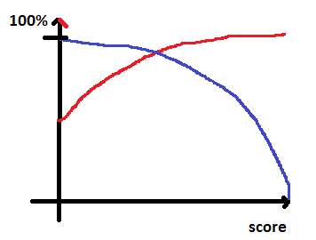
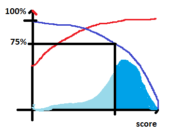

.. _question_projet_2014:

Questions Projets 2014
======================

.. _question_2014_projet_1_2A:

Quel type de problème pour quelles données ?
++++++++++++++++++++++++++++++++++++++++++++

Pour un problème de regréssion (linéaire ou non) ou de classification,
on s'attend à ce que les données
apparaissent dans une table classique, des colonnes pour les variables,
une colonne contenant la cible (ou target) : une valeur numérique pour la régression,
un label pour la classification. Dans cette configuration, les données sont supposées
indépendantes.

Un problème, c'est aussi souvent plein de données de sources différentes et reliées entre elles :

* Certaines données sont générées par les utilisateurs (données temps réels, ...),
  d'autres sont créées manuellement (classification de livres, ...).
* Elles peuvent être liées par le temps (série temporelles), géographiques (données
  spatiables), par une structure de réseau (facebook).

On peut aussi passer d'une représentation à l'autre en ajoutant des concepts
pour passer d'une structure à l'autre. Prenons l'exemple du jeu
`Amazon product co-purchasing network metadata <http://snap.stanford.edu/data/amazon-meta.html>`_.
Ce jeu contient des commentaires d'utilisateurs à propos de produits. On sait aussi
quand ce commentaire a été écrit. On dispose également
d'une classification des produits (DVD, livres, vidéos...). C'est une
`taxonomie <http://fr.wikipedia.org/wiki/Taxinomie>`_.

Un problème classique est d'essayer de prévoir si un utilisateur aimera
un produit ou non. C'est un
`système de recommandation <http://fr.wikipedia.org/wiki/Syst%C3%A8me_de_recommandation>`_.
On veut prédire une sorte de score d'un produit :math:`p`
pour un utilisateur :math:`u` à l'instant :math:`t`.

On peut voir cela comme un problème de régression et imaginer une table dans laquelle
on regroupe des caractéristiques sur les utilisateurs et les produits pour prédire un score.
On peut voir aussi cela comme un problème de classification en changeant le score par
la probabilité que l'utilisateur achète aime produit (classe 0 : il n'aime pas, classe 1 : il aime).

**Problème 1**

Cela dit, le jeu de données ne contient pas beaucoup de caractéristiques à part
des données agrégées : combien de produits l'utilisateur a aimé, combien de fois le
produit a été apprécié, combien de fois il l'a été récemment. On peut ajouter des données
agrégées par catégories. Ensuite, il suffit d'apprendre un modèle en utilisant
les évaluations des utilisateurs dont on dispose. C'est le problème 1.

**Problème 2, 2 bis**

On peut aussi se dire qu'on n'a peu exploité le fait que les utilisateurs se ressemblent
et que ceux qui se ressemblent aiment souvent les mêmes produits. On peut essayer
de construire un clustering (donc non supervisé) des utilisateurs. C'est le problème 2.
Ensuite, on utilise les probabilités d'appartenance des utilisateurs
aux clusters comme caractéristiques pour le problème 1.

On peut se dire qu'on aurait pu faire de même sur les produits. C'est le problème 3, toujours
pour améliorer les performances du modèle du problème 1.

L'inconvénient de ces deux approches est que le clustering opère sur des vecteurs de très
grandes dimensions et creux. Cela ne les rend pas toujours facile à réaliser.

**Problème 3**

Pourquoi ne pas traiter les deux en même temps en décrivant le problème
comme un système de recommandations. Les données sont structurées comme
un `graphe biparti <http://fr.wikipedia.org/wiki/Graphe_biparti>`_. Un utilisateur
d'un côté, un produit de l'autre, une évaluation pondère la relation entre les deux.
Ce n'est pas toujours évident d'évaluer la pertinence d'un tel système. Une façon de faire
est de transformer le résultat en caractéristiques pour revenir au problème 1.

Le système de recommandations peut être vu comme une façon de déterminer
la proximité entre deux produits ou deux utilisateurs. C'est une forme de distance.
Deux produits proches auront une distance en dessous d'un certain seuil.
On peut par exemple ajouter
comme caractéristiques le nombre de produits proches un utilisateur
a rédigé un commentaire.

**Problème 4**

Et les catégories ? C'est souvent une information assez fiable car elle a été construite
manuellement par ceux qui gèrent le service. Ils sont donc intéressés à ce que cette
information soit de qualité. En comparaison, les commentaires sont parfois très bruités.
Lorsqu'on manque d'information sur un produit en particulier (peu de commentaires),
on peut regrouper les produits peu évalués par leur catégorie dans le problème 3.
Il faut décider quels produits regrouper. On peut aussi les utiliser pour clusteriser les
utilisateurs : le vecteur sera d'une dimension abordable.

**Problème 5**

Et le temps ? On peut rechercher si certains produits sont passés de mode ou
si les utilisateurs découvrent les produits souvent dans le même ordre.
On peut aussi considérer que les commentaires les plus vieux ont moins de valeurs
et qu'il faut leur donner moins de poids. Comment choisir ce poids dépendant du temps ?

**Problème 6**

Une fois de retour au problème 1, on analyse les observations pour lesquelles
on fait le plus d'erreurs. On en déduit que l'un des problème évoqués ci-dessous
pourrait apporter la solution, une nouvelle caractéristique...

**...**

C'est un peu sans fin. Si l'objectif est de suggérer des produits qui
pourraient plaire à un utilisateur, une façon de mesurer la pertinence des
suggestions est de mesurer l'évolution du nombre d'achats par utilisateur,
de calculer la moyenne des évaluations et de voir si ces deux mesures augmentent.

**Remarque**

Il est facile d'évaluer un système temps réel sur le court terme et très difficile
sur le long terme. Recommander un best seller a beaucoup de chance de fonctionner
à court terme. A long terme, les utilisateurs peuvent se lasser de ces recommandations
qu'ils jugent peu-être un peu trop faciles.

.. _question_2014_projet_2_2A:

A propos de l'évaluation d'un système de recommandation
+++++++++++++++++++++++++++++++++++++++++++++++++++++++

Un système de recommandations consiste par exemple à proposer à un utilisateur des livres qu'il n'a pas
encore vu mais qu'il est susceptible d'apprécier. La seule information dont on dispose est ce que les utilisateurs ont acheté
ou commenté.
On la décrit sous forme de `graphe bi-parti <http://fr.wikipedia.org/wiki/Graphe_biparti>`_ :
d'un côté, les utilisateurs, de l'autre les livres, entre les deux des arcs qui
représente un achat (ou un commentaire).

**Pourquoi est tel système est-il difficile à évaluer ?**

Pour calculer un taux d'erreur, il faut connaître la réponse attendue. Or le nombre de critiques est souvent bien inférieur
à l'ensemble des critiques possibles (le nombre de livres multiplié par le nombre d'utilisateurs). Autrement dit,
il est illusoire de compter sur cette information. On peut y remédier en supprimant quelques arcs du graphe pour vérifier que
l'algorithme d'apprentissage arrive à retrouver cette information. On peut aussi demander à des juges humains d'évaluer
certains recommandations, typiquement les meilleurs recommandations obtenues après un premier apprentissage.

Pour s'assurer qu'un modèle ne fait pas de surapprentissage, il est courant de garder une partie des données
(base de test) pour évaluer le modèle appris sur le reste (base d'apprentissage). Dans le cas d'un système de recommandation,
les données sont liées dans graphe. Il est impossible de diviser le problème simplement. On peut clusteriser
mais il n'est pas dit que les sous-graphes obtenues soient homogènes.

On peut penser également que les données futures permettront de valider un modèle : une fois les recommandations en place,
le taux d'achats des utilisateurs devrait augmenter. On appelle cette évaluation *online*. C'est souvent la plus fiable et
elle est réalisé au moyen d'un `test AB <http://fr.wikipedia.org/wiki/Test_A/B>`_ : on divise le traffic
d'un site en deux, chaque partie reçoit un système de recommandation différent. Cette évaluation n'est cependant
pas toujours disponibles.

L'article `A Survey of Accuracy Evaluation Metrics of Recommendation Tasks <http://www.jmlr.org/papers/volume10/gunawardana09a/gunawardana09a.pdf>`_
recense d'autres directions.

Algorithmes de recommandations :

    * `Matrix Factorization <http://en.wikipedia.org/wiki/Non-negative_matrix_factorization>`_,
      voir aussi `Matrix factorization example with VW (Vowpal Wabbit) <https://github.com/JohnLangford/vowpal_wabbit/wiki/Matrix-factorization-example>`_
    * `Collaborative Filtering <http://en.wikipedia.org/wiki/Collaborative_filtering>`_
    * :ref:`exposerwrrecommandationrst`

Algorithms de clustering :

    * `Spectral Clustering <http://en.wikipedia.org/wiki/Spectral_clustering>`_ (`tutoriel <http://www.xavierdupre.fr/enseignement/tutoriel_python/confirme_graph.pdf>`_)
    * `Chinese Whiespering <http://wortschatz.uni-leipzig.de/~cbiemann/pub/2006/BiemannTextGraph06.pdf>`_
    * `Louvain Method <http://perso.uclouvain.be/vincent.blondel/research/louvain.html>`_
    * `RankClus <http://www1.se.cuhk.edu.hk/~hcheng/paper/edbt09_ysun.pdf>`_
    * `Latent Dirichlet Association <http://en.wikipedia.org/wiki/Latent_Dirichlet_allocation>`_ (détection de thèmes, topic detection)

.. _question_2014_projet_3_2A:

Pourquoi la régression logistique marche bien lorsqu'une classe est sous-représentée ?
++++++++++++++++++++++++++++++++++++++++++++++++++++++++++++++++++++++++++++++++++++++

Supposons qu'on doive constuire un classifieur binaire (deux classes). Lorsqu'une des classes est sous-représentée,
les algorithmes d'apprentissages aboutissent parfois à des modèles qui retournent toujours la même réponse : la classe sur-représentée.
Le taux d'erreur correspond à la proportion d'observations dans la classe sous-représentée.

L'`analyse discriminante linéaire <http://fr.wikipedia.org/wiki/Analyse_discriminante_lin%C3%A9aire>`_ échappe à ce biais
car elle consiste à trouver le meilleur hyperplan séparateur de deux nuages de points supposés gaussiens. Une
classe peut être sous-représentée, le modèle produira toujours deux classes.

L'analyse discriminante linéaire de la `régression logistique <http://fr.wikipedia.org/wiki/R%C3%A9gression_logistique>`_
qui ne suppose plus les nuages de points gaussiens mais conserve toujours de bonnes propriétés.

La régression logistique est équivalente à un `réseau de neurones <http://fr.wikipedia.org/wiki/R%C3%A9seau_de_neurones_artificiels>`_
de classification à une couche. Dans ce cas, l'algorithme d'apprentissage le plus courant
est celui d'une `descente de gradient stochastique <http://en.wikipedia.org/wiki/Stochastic_gradient_descent>`_.
Celui-ci est moins robuste dans le cas d'une classe sous-représenté tout simplement parce que
l'algorithme d'apprentissage utilisera plus beaucoup fréquemment les gradients calculés
pour des observations de l'autre classe. Il est souvent conseillé dans ce cas de modifier la distribution
des classes dans l'échantillon d'apprentissage de façon à ce qu'elle soit plus uniforme.

Il existe des algorithmes plus robustes comme `gradient boosting <http://en.wikipedia.org/wiki/Gradient_boosting>`_,
`AdaBoost <http://fr.wikipedia.org/wiki/AdaBoost>`_. Il s'agit de donner plus de poids aux exemples
qui produisent les plus grosses erreurs.

Une autre approche consiste à conserver l'algorithme d'optimisation de la régression logistique
et à multiplier les caractéristiques non linéaires constuires à partir des features existantes :
`Go non-linear with Vowpal Wabbit <http://fastml.com/go-non-linear-with-vowpal-wabbit/>`_.

.. _question_2014_projet_4_2A:

False positive, mais encore ?
+++++++++++++++++++++++++++++

A vrai dire, je me trompe encore et je me tromperai probablement toujours.
Le terme n'est pas très bien choisi. Je vous invite à lire l'introduction
de l'exercice du TD :ref:`td2acenoncesession4Arst`.

La courbe ROC s'applique uniquement à un classifieur. Lorsqu'on présente des résultats,
il faut faire attention si le cas *True Positive* correspond à :

* un exemple de la classe *A* classé dans la classe *A*
* un exemple d'une classe quelconque (*A*, *B*, ...) classé dans la bonne classe

.. _question_2014_projet_5_2A:

Aucun modèle ne fonctionne, que faire ? Des features ?
++++++++++++++++++++++++++++++++++++++++++++++++++++++

Lorsque deux modèles différents retourne le même type de performance, on
est souvent tenté d'en utiliser un troisième voire de jouer avec les meta-paramètres
(voir la paramètre :math:`\alpha` de la régression `lasso <http://scikit-learn.org/stable/modules/generated/sklearn.linear_model.Lasso.html>`_).
Que doit-on améliorer ? Le modèle, les features ?

Une première indication consiste à regarder si les deux modèles obtenus se trompent sur les mêmes observations.
Dans ce cas, il est plus probable que les modèles manquent d'informations sur ces observations.
Il faut alors se pencher sur ces observations pour imaginer des features qui les différencient
du reste des données. On peut soit tirer un échantillon parmi ces erreurs, soit regarder en
priorité les erreurs pour lesquelles le score de confiance est le plus élevé. Si c'est un problème
de classification, on peut aussi regarder les classes pour lesquelles le taux d'erreur est le plus élevé.

Si les deux modèles ne se trompent pas aux mêmes endroits, il est possible qu'un mélange de modèles
suffisent à améliorer la performance ou qu'un troisième parvienne finalement à tirer un meilleur parti
des features.

.. _question_2014_projet_6_2A:

A quoi doit ressembler une bonne courbe ROC ?
+++++++++++++++++++++++++++++++++++++++++++++

La courbe ROC illustre la performance d'un classifieur si celui-ci retourne une classe **et** un score.
Plus le score est élevé, plus la confiance dans le résultat est bonne : plus la probabilité qu'il se
trompe est faible. Par conséquence, une bonne courbe ROC vérifie :

* le taux de précision est croissant en fonction du score
* le taux de rappel est décroissant

Ce sont souvent des fonctions concaves (la précision est en rouge, le rappel en bleu).

Lorsque le score est élevé, il ne reste que quelques points (rappel proche de zéros).
On obtient quelque chose comme ceci :

.. image:: roc_a.png

La courbe du rappel est directement relié à la distribution du score de confiance retournée par le modèle.
C'est presque une fonction de répartition : :math:`rappel(s) = \inf_{S>s} dS`.

Si le score est pertinent, la probabilité de bien classer une observation augmente avec le score
mais cela veut dire aussi qu'on rejette des observations (on ne le classe pas) dont le score est trop faible.
Cela revient à faire un compromis entre le nombre d'exemples classés (= rappel) et la performance du modèle
sur ces exemples (= précision).

**Pourquoi le seuil de confiance retourné par le classifieur est-il important ?**

Dans le cas d'une reconnaissance de chèques, l'erreur coûte très chère. On considère qu'il est préférable
de traiter seulement les chèques pour lesquels
on sait que le taux d'erreur ne sera pas très grand. Pour chaque chèque, on applique le modèle de reconnaissance,
et si le seuil de confiance est inférieur à *s*, on traite le chèque manuellement. On a donc deux
chaînes de traitements et deux coûts différents :

* Si le seuil de confiance est :math:`> S`, le coût est :math:`C_a(S) = c_1 + c_2 (1-P(s))` où
  :math:`c_2 (1-P(s))` correspond au coût d'une erreur, :math:`c_1` correspond
  correspond au coût du traitement du chèque, :math:`1-P(s)` au taux d'erreur en fonction de *s*.
* Si le seuil de confiance est :math:`< S`, le chèque est reconnu manuellement et on
  suppose que le taux d'erreur :math:`e \sim 1\%` ne dépend pas du seuil.
  Le coût est alors :math:`C_m(s) = c_1 + c_1' + c_2 e` où :math:`c_1' >> c_1`
  est le coût du traitement manuel.

On cherche donc à minimiser le coût global
:math:`C = \min_s R(s) C_a(s) + (1-R(s)) C_m(s))`,
soit :math:`R(s) \left[ c_1 + c_2 (1-P(s)) \right ] + (1-R(s)) \left[ c_1 + c_1' + c_2 e \right]`.
