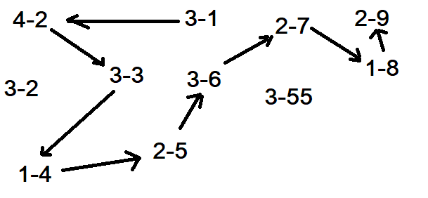

.. _floyd_fulkerson:

Problème de dès et problème de flots
====================================

.. index:: flot, dé, Floyd-Fulkerson, graphe

Cet exposé commence par un problème issue de Google Jam:
`Dice Straight <https://code.google.com/codejam/contest/6314486/dashboard#s=p0>`_.
On dispose de dés à six faces, sur chaque face, un nombre entier quelconque.
Il faut trouver la plus grande séquence de dés qu'on peut poser
sur une ligne en formant une suite de nombres entiers consécutifs.
Par exemple, avec les quatre dés suivants :

::

    4 8  15 16 23 42
    8 6  7  5  30 9
    1 2  3  4  55 6
    2 10 18 36 54 86

Il existe une séquence de 3 dés en prenant les couples
(dé, face) : ``(4,2), (3,3), (1,4), (2,5)``.
Comment trouver la longueur de la plus grande séquence
de ce type ?

Quelques propriétés
+++++++++++++++++++

On peut aisément trouver des majorants pour cette séquence la plus grande :

- Elle ne peut pas être plus grande que le nombre de dés.
- Elle ne peut pas être plus grande que la différence qui séparé
  la plus petite et la plus grande face.

La seconde propriété peut même être affinée. Nn note *V*
l'ensemble des faces. Si une face *f* n'existe pas dans l'intervalle
:math:`[min(V), max(V)]`, on sait que la plus grande séquence
sera soit dans l'intervalle :math:`[min(V), f-1]`,
soit :math:`[f+1, max(V)]`.
On poursuit ce raisonnement et on construit une suite d'intervalles
qui contiennent des entiers consécutifs de telle sorte que deux entiers
dans l'intervalle apparaissent sur les faces de deux dés distincts.

.. runpython::
    :showcode:

    text = """1
    4
    4 8  15 16 23 42
    8 6  7  5  30 9
    1 2  3  4  55 6
    2 10 18 36 54 86"""

    from ensae_teaching_cs.td_2a import DiceStraight
    probs = DiceStraight.parse(text)
    print(probs[0].find_intervals())

Une piste gourmande
+++++++++++++++++++

On peut construire un graphe pour lequel chaque noeud est un couple
*(dé, face)*, chaque arc relie deux noeuds qui peuvent faire
partie d'une séquence. Une solution consiste à trouver dans ce graphe
un chemin le plus long possible qui ne passe pas deux fois par le même dé.
L'image suivant représente une partie du graphe qu'on peut construire
ainsi avec le problème ci-dessus.

On peut facilement modifier l'algorithme de
`Dikjstra <https://fr.wikipedia.org/wiki/Algorithme_de_Dijkstra>`_
(plus court de chemins)
pour conserver l'historique des noeuds visités mais on peut
prédire que sur certains problèmes, ce nombre d'historiques
va être très grand et grandir exponentiellement.

Si nous avons, six dés identiques, n'importe quelle séquence
fonctionne et le nombre de chemins est aussi grand que le nombre
de permutations. On peut néanmoins se contenter de conserver
le nombre de noeuds distincts et non la séquence de noeuds
mais la quantité d'information sera tout de même importante
car il faut conserver tous les ensembles de noeuds distincts.

On peut aussi construire un graphe où chaque noeud
est repéré par un triplet *(position, dé, face)*. Le graphe
a plus de noeuds que le précédent mais autant d'arcs mais cela
n'apporte pas grand chose pour le moment. On peut aussi
construire un graphe dans lequel chaque noeud
réprésente deux dés qu'on peut placer dans une séquence.
Le graphe est plus grand mais possède moins d'arcs. Mais cela
a peut de chance d'aboutir.

.. runpython::
    :showcode:

    text = """1
    4
    4 8  15 16 23 42
    8 6  7  5  30 9
    1 2  3  4  55 6
    2 10 18 36 54 86"""

    from ensae_teaching_cs.td_2a import DiceStraight
    probs = DiceStraight.parse(text)
    seq = probs[0].longest_path_length_graph(fLOG=print)
    print("Séquence la plus grande :", seq)

Problème de flots
+++++++++++++++++

Les solutions précédentes qui fonctionnent sur de petits graphes
retournent un chemin or nous n'avons besoin que de la longueur
de ce chemin. Peut-on trouver un algorithme qui lors de son
optimisation tienne compte du fait qu'il ne faut pas passer
deux fois par le même dé sans pour autant retenir cette information ?

Le `problème du flot maximal <https://fr.wikipedia.org/wiki/Probl%C3%A8me_de_flot_maximum>`_
consiste à trouver le débit maximal qu'un réseau de canalisation
peut faire passer d'un point A à un point B en tenant des capacités de chaque
tuyau qu'on résoud avec un algorithme de
`Floyd-Fulkerson <https://en.wikipedia.org/wiki/Ford%E2%80%93Fulkerson_algorithm>`_ ou
`Edmonds-Karp <https://en.wikipedia.org/wiki/Edmonds%E2%80%93Karp_algorithm>`_.
Cet algorithme est utile pour ce problème si on arrive à construire
un diagramme pour lequel le flot maximal indique la longueur de la plus
grande séquence de dés.
Etant donné qu'il n'y pas de notion de débit dans le problème de dés
mais plutôt d'existence, il s'agit plus de déterminer si le flot maximal
est positif ou nul.

.. image:: dice/dice_flot.jpg
    :width: 800

L'idée est de créer un réseau qui passe par des tuyaux dont on peut
partager les capacités de sorte que s'il est emprunté
à un moment, il ne le soit pas à un autre. On peut essayer de bidouiller
l'algorithme original afin de tenir compte de ces coefficients
partagés sans garantie toutefois que l'algorithme converge.

*à suivre*
