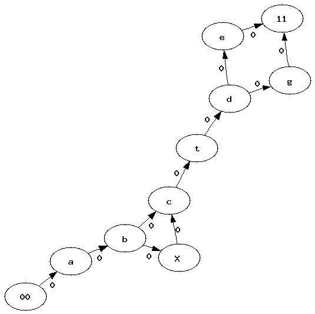
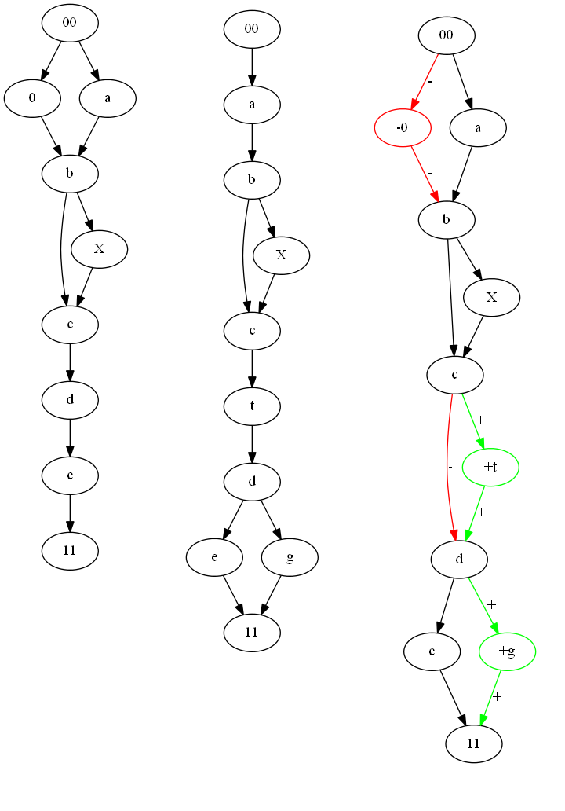

.. _l-graph_distance:

Distance between two graphs
===========================

.. contents::
    :local:

Definitions
+++++++++++

The first approach is implemented in module :mod:`graph_distance <ensae_teaching_cs.special.graph_distance>`.
Example of use:

::

    graph1 = [ ("a","b"), ("b","c"), ("b","d"), ("d","e"), \
               ("e","f"), ("b","f"), ("b","g"), ("f", "g"), 
               ("a","g"), ("a","g"), ("c","d"), ("d", "g"), 
               ("d","h"), ("aa","h"), ("aa","c"), ("f", "h"), ]
    graph2 = copy.deepcopy(graph1) + \
             [ ("h", "m"), ("m", "l"), ("l", "C"), ("C", "r"),
               ("a", "k"), ("k", "l"), ("k", "C"), 
               ]

    graph1 = Graph(graph1)
    graph2 = Graph(graph2)

    distance, graph = graph1.distance_matching_graphs_paths(graph2, use_min=False, store=store)
    
*graph* is the merged graph mentioned below.

Problem
+++++++

This *graph distance* aims at computing a distance between graphs but 
also to align two graphs and to merge them into a single one. 
For example, let's consider the following graphs:

We would like to merge them and to know which vertices were merged, 
which ones were added and deleted. 
The following ideas and algorithm are only applicable on graphs 
without cycles. To simplify, we assume there are only one root and one leave. 
If there are mulitple, we then create a single root we connect to all 
the existing ones. We do the same for the unique leave we create if there are multiple. 
It will have all the existing ones as predecessors.
We also assume each vertex and each edge holds a label used during 
the matching. It is better to match vertices or edges holding the same label. 
A weight can be introduced to give more important to some elements (vertex, edge).

First approach
++++++++++++++

Step 1: edit distance
^^^^^^^^^^^^^^^^^^^^^

The main idea consists in using `Levenstein's edit distance <https://en.wikipedia.org/wiki/Levenshtein_distance>`_. 
This algorithm applies on sequences but not on graphs. 
But because both graphs do not contain any cycle, we can extract all 
paths from them. Every path starts with the same vertex - the only root - 
and ends with the same one - the only leave -. 
We also consider each edge or vertex as an element of the sequence. 
Before describing the edit distance, let's denote :math:`p_1` as a path 
from the first graph, :math:`p_2` as a path from the second one. 
:math:`p_k(i)` is the element *i* of this sequence. Following Levenstein description, 
we denote *d(i,j)* as the distance between the two subsequences 
:math:`p_1(1..i), p_2(1..j)`. Based on that, we use an edit distance defined as follows:

.. math::

    d(i,j) = \min \left \{ \begin{array}{l}
                                d( i-1,j) + insertion(p_1(i)) \\
                                d( i,j-1) + insertion(p_2(j)) \\
                                d( i-1,j-1) + comparison(p_1(i),p_2(j)) 
                                \end{array}
                                \right .

First of all, we are not only interested in the distance but also 
in the alignment which would imply to keep which element was 
chosen as a minimum for each *d(i,j)*. If we denote :math:`n_k` 
the length of path *k*, then :math:`d(n_1,n_2)` is the distance we are looking for.

Second, if two paths do not have the same length, 
it implies some elements could be compared between each others even 
if one is an edge and the other one is a vertex. 
This case is unavoidable if two paths have different lengths.

Third, the weight we use for the edit distance will be involved 
in a kind of tradeof: do we prefer to boost the structure or 
the label when we merge the graphs. Those weights should depend on the task, 
whether or not it is better to align vertices with the same label 
or to keep the structure. Here are the chosen weights:

+-------------------+--------------------------------+----------------------------------------------------------------------------------------------------+
| operation         | weight                         | condition                                                                                          |
+===================+================================+====================================================================================================+
| *insertion(c)*    |                                | *w(c)*, weight held by the edge or the vertex                                                      |
+-------------------+--------------------------------+----------------------------------------------------------------------------------------------------+
| *comparison(a,b)* | 0                              | if vertices *a* and *b* share the same label                                                       |
+-------------------+--------------------------------+----------------------------------------------------------------------------------------------------+
| *comparison(a,b)* | 0                              | if edges *a* and *b* share the same label and if vertices at both ends share the same label        |
+-------------------+--------------------------------+----------------------------------------------------------------------------------------------------+
| *comparison(a,b)* | :math:`w(a)+w(b)`              | if edges *a* and *b* share the same label and if vertices at both ends do not share the same label |
+-------------------+--------------------------------+----------------------------------------------------------------------------------------------------+
| *comparison(a,b)* | :math:`\frac{w(a)+w(b)}{2}`    | if *a* and *b* do not share the same kind                                                          |
+-------------------+--------------------------------+----------------------------------------------------------------------------------------------------+
| *comparison(a,b)* | :math:`\frac{3(w(a)+w(b))}{2}` | if *a* and *b* share the same kind but not the label                                               |
+-------------------+--------------------------------+----------------------------------------------------------------------------------------------------+

Kind means in this context edge or vertex. In that case, we think that sharing 
the same kind but not the same label is the worst case scenario. Those weights 
avoid having multiples time the same distance between two random paths which will 
be important during the next step. In fact, because the two graphs do not contain cycles, 
they have a finite number of paths. We will need to compute all distances 
between all possible pairs. The more distinct values we have for a distance between two paths, the better it is.

Step 2: Kruskal kind (bijection on paths)
^^^^^^^^^^^^^^^^^^^^^^^^^^^^^^^^^^^^^^^^^

Among all possible distances we compute between two paths, 
some of them might be irrelevant. If for some reasons, 
there is an edge which connects the root to the leave, computing 
the edit distance between this short path and any other one seems weird. 
That's why we need to consider a kind of paths association. 
We need to associate a path from a graph to another from the other graph and 
the association needs to be a bijection assuming two close paths will have a low distance.

After the first step, we ended up with a matrix containing all possible distances. 
We convert this matrix into a graph where each path is a vertex, each distance 
is a weighted edge. We use a kind of Kruskal algorithm to remove heavy 
weighted edges until we get a kind of bijection:

* We sort all edges by weight (reverse order).
* We remove the first ones until we get an injection on both sides: 
  a path from a graph must be associated to only one path.

Basically, some paths from the bigger graph will not be teamed up with another path.

Step 3: Matching
^^^^^^^^^^^^^^^^

Now that we have a kind of bijection between paths, it also means we have a series 
of alignments between paths: one from the first graph, one from the second 
graph and an alignment between them computed during the step. 
We build two matrices, one for the edges :math:`M_e`, one for 
the vertices :math:`M_v` defined as follows:

* :math:`M_e(i,j)` contains the number of times edge *i* from graph 1 
  is associated to edge *j* from graph 2 among all paths associated by the previous step.
* :math:`M_v(i,j)` contains the same for the vertices.

Step 4: Kruskal kind, the return (bijection on edges and vertices)
^^^^^^^^^^^^^^^^^^^^^^^^^^^^^^^^^^^^^^^^^^^^^^^^^^^^^^^^^^^^^^^^^^

We now have two matrices which contains pretty much the same information 
as we have in step 2: each element is the number of times an edge or a vertex 
was associated with an edge or a vertex of the other graph. 
We use the same algorithm until we get a kind of bijection between vertices or edges from both matrices.

Step 5: Merging the two graphs
^^^^^^^^^^^^^^^^^^^^^^^^^^^^^^

Once we finalized the previous steps, we know which vertices and edges will be 
associated with vertices and edges from the other graph. 
What's left is to add the left over to the picture which is shown by next Figure:

*Red and symbol - means deleted from graph~1 and not present in graph 2. 
Green and symbol + means not present in graph 1 and added in graph 2. 
The black pieces remains unchanged.*

The main drawback of this algorithm is its speed. It is very time consuming. 
We need to compute distances between all paths which is ok when graphs are small but very long 
when graphs are bigger. Many paths share the same beginning and we could certainly 
avoid wasting time computing edit distances between those paths.

Distance between graphs
+++++++++++++++++++++++

We defined a distance between two sequences based on the sum of operations 
needed to switch from the first sequence to the second one, 
we can follow the same way here. The alignment we were able to build 
between two graphs shows insertions, deletions and comparisons of different 
edges of vertices. By giving a weight of each kind, we can sum them to 
build the distance we are looking for. We use the same weights we 
defined to compute the alignment between two paths from both graphs. 
Let's defined an aligned graph *G = { (a,b) }*, *G* is the set of edges and 
vertices of the final graph, *a*, *b* are an edge of a vertex from the first 
graph for *a* and from the second graph for *b*. *a* or *b* can be null. 
We also defined :math:`insertion(a) = comparison(\emptyset,a)`.

.. math::

    d(G_1,G_2) = \sum_{ \begin{subarray}{c} a \in G_1\cup \emptyset \\ b \in G_2 \cup \emptyset \end{subarray} }  
    comparison(a,b) \indicatrice{ (a,b) \in G }

It is obvioulsy symmetric. To proove it verifies 
:math:`d(G_1,G_2) = 0 \Longleftrightarrow G_1 = G_2`, 
we could proove that every path from :math:`G_1` will be associated to itself during the first step. 
It is not necessarily true because two different paths could share the same 
sequence of labels. Let's consider the following example:

.. math::

    \xymatrix{
    begin \ar[r]\ar[dr] & 1,a \ar[r]  & 2,b \ar[r]\ar[dl]  & end \\
                        & 3,a \ar[r]  & 4,b \ar[ur]        & 
    }

This graph contains three paths:

.. math::

    \begin{array}{lll}
    path 1 & 1,2 & ab\\
    path 2 & 3,4 & ab \\
    path 3 & 1,2,3,4 & abab
    \end{array}

The matrix distance between paths will give (*x> 0*):

.. math::

    \pa{\begin{array}{ccc}
    0  & \mathbf{0.} & x  \\
    \mathbf{0.}  & 0 & x  \\
    x  & x & \mathbf{0.}
     \end{array}}

The bolded values :math:`\mathbf{0.}` represent one possible association between 
paths which could lead to the possible association between vertices:

.. math::

    \pa{\begin{array}{cccc}
    1           & 0          & 1           & 0 \\
    0           & 1          & 0           & 1 \\
    1           & 0          & 1           & 0 \\
    0           & 1          & 0           & 1 
    \end{array}}

In that particular case, the algorithm will not return a null 
distance mostly because while aligning sequences, we do not pay too much attention 
to the local structure. One edge could be missing from the alignment. 
We could try to correct that by adding some cost when two vertices 
do not have the number of input or output edges instead of considering only the labels.
        
        
Second approach: faster
+++++++++++++++++++++++

No implemented yet.

