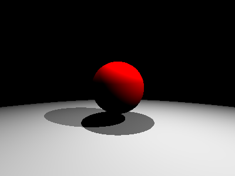
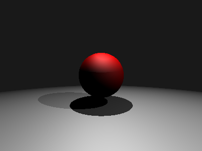
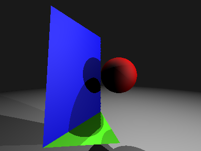
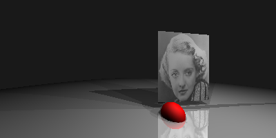

.. _l-image_synthese:

Image de synthèse, lancer de rayon
==================================

Simple model
++++++++++++

`Lancer de rayon <https://fr.wikipedia.org/wiki/Lancer_de_rayon>`_

:mod:`image_synthese_scene <ensae_teaching_cs.special.image.image_synthese_scene>`

::

    import math
    import pygame
    from ensae_teaching_cs.special.image.image_synthese_base import Vecteur, Couleur, Source, Repere
    from ensae_teaching_cs.special.image.image_synthese_sphere import Sphere
    from ensae_teaching_cs.special.image.image_synthese_scene import Scene    
    from ensae_teaching_cs.helpers.pygame_helper import wait_event

    s = Scene (Repere(), math.pi / 1.5, 400, 300)
    s.ajoute_source(Source(Vecteur(0,10,10), Couleur(1,1,1)))
    s.ajoute_source(Source(Vecteur(10,10,5), Couleur(0.5,0.5,0.5)))
    s.ajoute_objet(Sphere(Vecteur(0,0,12), 3, Couleur(1,0,0)))
    s.ajoute_objet(Sphere(Vecteur(0,-400,12), 396, Couleur(0.5,0.5,0.5)))
    
    screen = pygame.display.set_mode (s.dim)
    screen.fill((255, 255, 255))
    s.construit_image(screen, fLOG=print)
    wait_event(pygame)
    
    

Ombrage de Phong
++++++++++++++++

`Ombrage de Phong <https://fr.wikipedia.org/wiki/Ombrage_de_Phong>`_

::

    import math
    import pygame
    from ensae_teaching_cs.special.image.image_synthese_base import Vecteur, Couleur, Source, Repere
    from ensae_teaching_cs.special.image.image_synthese_sphere import Sphere
    from ensae_teaching_cs.special.image.image_synthese_phong import ScenePhong
    from ensae_teaching_cs.helpers.pygame_helper import wait_event

    s = ScenePhong (Repere (), math.pi / 1.5, 400, 300)
    s.ajoute_source ( Source (Vecteur (0,10,10), Couleur (1,1,1) ) )
    s.ajoute_source ( Source (Vecteur (10,10,5), Couleur (0.5,0.5,0.5) ) )
    s.ajoute_objet  ( Sphere  (Vecteur (0,0,12), 3, Couleur (1,0,0) ) )
    s.ajoute_objet  ( Sphere  (Vecteur (0,-400,12), 396, Couleur (0.5,0.5,0.5) ) )
    
    screen = pygame.display.set_mode (s.dim)
    screen.fill((255, 255, 255))
    s.construit_image(screen, fLOG=print)
    wait_event(pygame)
    

Facette
+++++++

::

    import math
    import pygame
    from ensae_teaching_cs.special.image.image_synthese_base import Vecteur, Couleur, Source, Repere
    from ensae_teaching_cs.special.image.image_synthese_sphere import Sphere
    from ensae_teaching_cs.special.image.image_synthese_phong import ScenePhong
    from ensae_teaching_cs.special.image.image_synthese_facette import Facette, Rectangle
    from ensae_teaching_cs.helpers.pygame_helper import wait_event

    s = ScenePhong (Repere (), math.pi / 1.5, 400, 300)

    s.ajoute_source ( Source (Vecteur (0,8,8), Couleur (0.6,0.6,0.6) ) )
    s.ajoute_source ( Source (Vecteur (10,0,0),  Couleur (0.6,0.6,0.6) ) )
    s.ajoute_source ( Source (Vecteur (8,8,4.5),  Couleur (0.6,0.6,0.6) ) )
    s.ajoute_objet  ( Sphere  (Vecteur (1,0,5),  1, Couleur (1,0,0) ) )
    s.ajoute_objet  ( Sphere  (Vecteur (0,-400,12),  396, Couleur (0.5,0.5,0.5) ) )
    s.ajoute_objet (Facette ( Vecteur (0,-2.5,6),   Vecteur (-2,-2.5,3), 
                               Vecteur (1,-3.5,4.5),  Couleur (0.2,0.8,0)))
    s.ajoute_objet (Rectangle ( Vecteur (0,-2.5,6),   Vecteur (-2,-2.5,3), 
                               Vecteur (-2,2.8,3.5),  None, Couleur (0,0,1)))
    
    screen = pygame.display.set_mode (s.dim)
    screen.fill((255, 255, 255))
    s.construit_image(screen, fLOG=print)
    wait_event(pygame)
    

Avec une image
++++++++++++++

::

    import math
    import pygame
    from ensae_teaching_cs.special.image.image_synthese_base import Vecteur, Couleur, Source, Repere
    from ensae_teaching_cs.special.image.image_synthese_sphere import Sphere
    from ensae_teaching_cs.special.image.image_synthese_phong import ScenePhong
    from ensae_teaching_cs.special.image.image_synthese_facette import Facette, Rectangle
    from ensae_teaching_cs.special.image.image_synthese_facette_image import RectangleImage, SphereReflet
    from ensae_teaching_cs.helpers.pygame_helper import wait_event
    
    image = "..."

    s = ScenePhong(Repere (), math.pi / 1.5, 400, 200)

    s.ajoute_source ( Source (Vecteur (0,8,8), Couleur (0.4,0.4,0.4) ) )
    s.ajoute_source ( Source (Vecteur (10,0,0), Couleur (0.4,0.4,0.4) ) )
    s.ajoute_source ( Source (Vecteur (8,8,4.5), Couleur (0.4,0.4,0.4) ) )
    s.ajoute_objet  ( Sphere  (Vecteur (3,-4,7), 1, Couleur (1,0,0) ) )
    s.ajoute_objet  ( SphereReflet  (Vecteur (0,-400,12), 396, Couleur (0.5,0.5,0.5), 0.5 ) )
    s.ajoute_objet (RectangleImage ( Vecteur (8,-3.5,9),  Vecteur (2,-3.5,8), 
                    Vecteur (2,3.8,8),  None, image, invertx = True))

    s.ajoute_source ( Source (Vecteur (7,2,8),  Couleur (0.2,0.2,0.2) ) )
    s.ajoute_source ( Source (Vecteur (12.5,3,5),  Couleur (0.2,0.2,0.2) ) )
                        
    s.ajoute_source ( Source (Vecteur (-12.5,1,6),  Couleur (0.2,0.2,0.2) ) )
                        
    s.ajoute_objet (Rectangle ( Vecteur (-12.4,0.99,5.9),  Vecteur (-12.6,0.99,5.9),
                               Vecteur (-12.6,0.99,6.1),  None,  Couleur (0,0,0)))
    
    screen = pygame.display.set_mode (s.dim)
    screen.fill((255, 255, 255))
    s.construit_image(screen, fLOG=print)
    wait_event(pygame)
    

