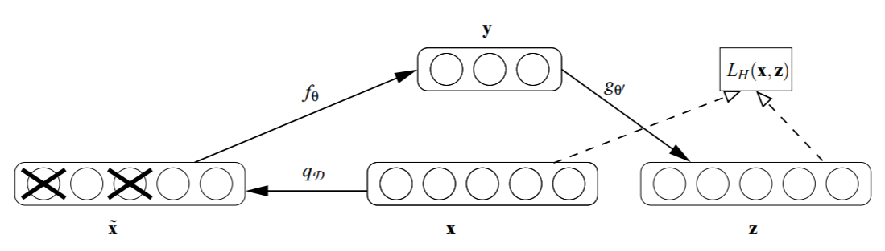
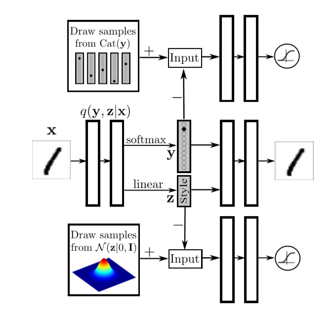
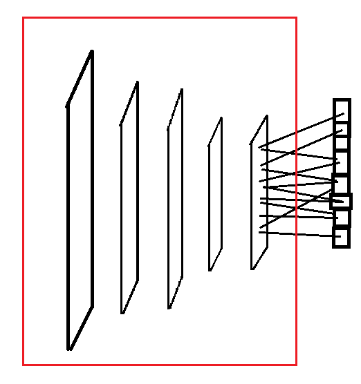

.. _l-nolabel:

Apprentissage sans labels
=========================

.. contents::
    :local:

Rappels
-------

L'apprentissage supervisé nécessite des données
*annotées*. Chaque exemple est un couple
:math:`(X, Y)` où *X* est ce qu'on mesure ou
ce qui est connu, *Y* est la réponse qu'on veut prédire.
La prédiction passe le plus souvent par la construction
d'une fonction paramétrique :math:`f(X,\Theta)`.

Pour apprendre une telle fonction, on dispose d'une base d'apprentissage
:math:`(X_1, Y_1), ..., (X_n, Y_n)`. C'est-à-dire qu'on connaît la prédiction
pour un ensemble de points. On souhaite
déterminer les coefficients :math:`\Theta` qui minimise
une certaine fonction d'erreur :math:`\sum_i E(f(X_i,\Theta), Y_i)`
qui est nulle lorsque la prédiction et parfaite
(:math:`f(X_i,\Theta)=Y_i`) en chaque point.

Plus on a de points ou d'observations, plus on a d'informations pour déterminer les coefficients
:math:`\Theta`. Pour un réseau de neurones, on considère souvent qu'il faut dix fois d'observations
que de coefficients pour bien apprendre ou plutôt pour ne pas apprendre par coeur.

Pas de labels ?
---------------

Créer un modèle de prédiction implique qu'on sache formaliser le problème,
qu'on sache extraire ce qu'on observe et ce qu'on doit prédire. Ce n'est
pas toujours évident. Essayons par exemple de construire un modèle
qui reconnaît ce qu'il y a sur une image. On peut commencer
par distinguer entre `chien et chats <https://www.kaggle.com/c/dogs-vs-cats/data>`_
ou reconnaître un `décor <http://lsun.cs.princeton.edu/2016/>`_ ou encore des visages :

.. figure:: https://upload.wikimedia.org/wikipedia/commons/e/ef/Face_detection.jpg
    :width: 400
    :alt: source wikipédia

On ne sait pas encore construire la machine capable de reconnaître n'importe quoi.
Que fait-on s'il y a un chat et un chien sur la même image ? Doit-on construire un modèle
plus complexe ou décider que le modèle n'est pas prévu pour donner une réponse fiable dans
ce cas ? La formalisation est souvent le résultat d'un compromis entre l'utilité du problème,
la facilité avec laquelle on pense le résultat, la capacité de construire ces labels.
Il arrive parfois qu'on ne sache pas construire ces labels. Sauriez-vous distinguer la signature
accoustique d'une baleine de celle d'un cachalot ?

On ne sait pas labelliser.
++++++++++++++++++++++++++

On est obligé d'apprendre en faisant. On part toujours de ce qu'on sait.
Si on doit construire une classification sans savoir ce que sont les deux classes
à prédire, on va essayer de regrouper les observations en deux classes puis
essayer de comprendre si les deux groupes ainsi formés ont quelque chose
à voir avec le problème initial quitte à ne pas savoir tout classer. On peut aussi
essayer de trouver une autre source d'information pour construire quelques labels.

On veut parfois construire un système d'alerte qui doit prédire si une anomalie survient ?
Mais on ne sait pas ce que c'est une anomalie. On regarde alors les événements extrêmes pour
cerner un peu mieux puis petit à petit définir ce qu'on attend du modèle de prédiction.

On a peu de labels.
+++++++++++++++++++

On sait que la complexité du modèle nécessite plus d'exemples que ceux
dont on dispose. On a quelques couples :math:`(X_i, Y_i)` pour lesquels
on connaît la réponse et beaucoup de :math:`X_j` pour lesquels on ne sait pas.
On commence par construire un petit modèle et on regarde sa réponse sur les exemples
sans labels. Que se passe-t-il quand il est très sûr de lui (score de confiance élevé)
ou pas du tout (score de confiance nul) ? On s'aperçoit parfois que les labels produits
sont assez faibles et on les incorpore à la base d'apprentissage pour construire
un modèle plus imposant.

Un autre idée consiste à réutiliser un modèle déjà appris pour autre chose et
celui-ci disposait d'une grande base d'apprentissage. Cela marche beaucoup dans la
classification d'images. Il existe des modèles disponibles sur internet
comme `VGG <http://www.robots.ox.ac.uk/~vgg/research/very_deep/>`_. Il ne font pas exactement
ce qu'on veut mais on peut essayer d'utiliser ce qu'ils ont appris.
C'est l'`apprentissage par transfert <https://fr.wikipedia.org/wiki/Apprentissage_par_transfert>`_
ou *transfert learning*.

On a des labels bruités.
++++++++++++++++++++++++

Pas mal de gens mettent leurs photos sur internet en y apposant une légende.
Pour ceux qui les stockent, c'est une manne très intéressante pour faire de la
classification d'images. La légende n'est pas nécessairement reliée au problème en question
mais existe un moyen de transformer automatiquement tout ou partie de ces labels
en quelque chose qui soit utile ?

Un clic sur internet n'est pas nécessairement signe que le lien est intéressant. Il
peut être suivi d'un *quick back* auquel l'internaute a jugé rapidement que cela
ne l'était pas. On a dès lors la tentation de filtrer entre les bons et les mauvais clics
ou de construire des modèles où ce qui est observé dépend du vrai label mais qui est caché.

Dans les deux cas, on cherche à comprendre si le bruit des labels est en partie
systématique et si tel est le cas, comment se servir de ce label biaisé.

Revue non exhaustive d'outils et modèles
----------------------------------------

Il n'existe pas de réponse systèmatique au manque de labels. Il est important
de bien comprendre les données pour choisir les bons outils et modèles qui seront
le plus pertinent. Voici quelques pistes de réflexions.

Réduction de dimension
++++++++++++++++++++++

Les labels sont en trop petit nombre et le modèle de prédiction n'arrive pas à généraliser.
L'espace des features :math:`X_i` est trop grand. L'idée consiste à trouver un espace
de features plus petits dans lequel deux observations similaires sont plus proches que
dans l'ensemble de départ. On peut classer les chiffres à partir des pixels,
des images 8x8 dans l'exemple ci-dessous.

.. figure:: http://scikit-learn.org/stable/_images/sphx_glr_plot_lle_digits_001.png
    :alt: source : scikit-learn
    :width: 400

Ou on peut essayer de trouver un espace à deux dimensions dans lequel c'est plus simple
comme avec une projection `t-SNE <https://lvdmaaten.github.io/tsne/>`_.

.. figure:: http://scikit-learn.org/stable/_images/sphx_glr_plot_lle_digits_013.png
    :alt: source : scikit-learn
    :width: 400

Cette représentation en plus petite dimensions sont en quelque sorte
une compression de l'information avec perte. On espère que cette perte est
essentiellement du bruit et qu'il reste l'information pertinente.

**Non supervisé**

La méthode la plus connue est l'ACP ou
`Analyse en Composantes Principales <https://fr.wikipedia.org/wiki/Analyse_en_composantes_principales>`_,
`Sparse PCA <http://scikit-learn.org/stable/modules/decomposition.html#sparse-principal-components-analysis-sparsepca-and-minibatchsparsepca>`_,
`Kernal PCA <http://scikit-learn.org/stable/modules/generated/sklearn.decomposition.KernelPCA.html#sklearn.decomposition.KernelPCA>`_.
On peut évoquer aussi `Sparce Coding <http://scikit-learn.org/stable/modules/decomposition.html#sparsecoder>`_
(lire `Online Dictionary Learning for Sparse Coding <http://www.di.ens.fr/sierra/pdfs/icml09.pdf>`_). Il s'agit
de représenter chaque élément de la base d'apprentissage comme une combinaison linéaire
`sparse <https://fr.wikipedia.org/wiki/Matrice_creuse>`_ d'un petit d'éléments représentatifs.

**Supervisé**

La première idée s'addresse à un problème de classification. On souhaite
construire un espace dans lequel les classes du problèmes de classification
sont les plus éloignées possibles. C'est l'objectif de la transformation
`t-SNE <https://lvdmaaten.github.io/tsne/>`_ mais ce n'est pas la seule
`Manifold learning <http://scikit-learn.org/stable/modules/manifold.html>`_.
La seconde idée reprend l'idée de compression avec perte et l'applique
sous la forme d'un réseau avec les `auto-encoders <https://en.wikipedia.org/wiki/Autoencoder>`_.

.. index:: auto-encoder, réseau diabolo

**auto-encoders**

L'article `Adversarial Autoencoders <https://arxiv.org/abs/1511.05644>`_ illustre
comment cette technique est utilisée (voir
`Adversarial Autoencoders (with Pytorch) <https://blog.paperspace.com/adversarial-autoencoders-with-pytorch/>`_
pour un exemple de code).

.. figure:: nolabelimg/aagan.png
    :alt: image extraite de *Adversarial Autoencoders*
    :scale: 80%

    Image extraite de
    `Adversarial Autoencoders (with Pytorch) <https://blog.paperspace.com/adversarial-autoencoders-with-pytorch/>`_.

Le réseau de neurones inclut une couche cachée dont la dimension est réduite.
Il apprend à compresser et restituer un grand nombre d'image. Les labels ne sont
pas utilisées. La sortie de la couche cachée est utilisée comme entrée d'un modèle
supervisé utilisant les labels mais plus facile à entraîner puisque l'espace
d'entrée a été réduit.

L'article `Why Does Unsupervised Pre-training Help Deep Learning? <http://www.jmlr.org/papers/volume11/erhan10a/erhan10a.pdf>`_
montre cette étape de compression ou *pre-training* aide même dans le cas où les labels
ne manquent pas.
L'article `Stacked Denoising Autoencoders: Learning Useful Representations in a Deep Network with a Local Denoising Criterion <http://www.jmlr.org/papers/volume11/vincent10a/vincent10a.pdf>`_
étudie la possibilité de préentraîner chaque couche d'un réseau de neurones avec un auto-encoder (SDA). Celui-ci
n'apprend pas seulement à reconstruire une image *x* à partir d'elle-même
mais aussi à reconstuire *x* à partir d'une image bruitée de *x*.

    Image extraite de
    `Stacked Denoising Autoencoders: Learning Useful Representations in a Deep Network with a Local Denoising Criterion <http://www.jmlr.org/papers/volume11/vincent10a/vincent10a.pdf>`_.

L'idée de bruiter les données pour mieux apprendre est aussi présente
dans l'article
`Learning with Marginalized Corrupted Features <http://proceedings.mlr.press/v28/vandermaaten13.pdf>`_
qui a inspiré
`Marginalizing Stacked Linear Denoising Autoencoders <http://www.jmlr.org/papers/volume16/chen15c/chen15c.pdf>`_
qui se présente comme une version plus rapide des SDA car en partie linéaire.
Les `Variational Autoencoders <http://kvfrans.com/variational-autoencoders-explained/>`_ introduisent une
contrainte sur la couche cachée dont les sorties doivent suivre une certaine loi
souvent gaussiennes. C'est en quelque sorte un paramètre de régularisation.
Pour finir un tutoriel mathématiques sur les auto-encoders :
`Tutorial on Variational Autoencoders <https://arxiv.org/abs/1606.05908>`_
qui évoque aussi les auto-encodeurs booléens qui sont utilisés pour faire
du clustering dans l'article
`Autoencoders, Unsupervised Learning, and Deep Architectures <http://proceedings.mlr.press/v27/baldi12a/baldi12a.pdf>`_.
La couche intermédiaire booléene indique dans quel cluster classer une observation.

.. index:: compress sensing

**Compress Sensing**

L'article `Compressed sensing and single-pixel cameras <https://terrytao.wordpress.com/2007/04/13/compressed-sensing-and-single-pixel-cameras/>`_
explique assez clairement ce qu'est le *compress sensing* ou
`acquisition comprimée <https://fr.wikipedia.org/wiki/Acquisition_comprim%C3%A9e>`_.
Il prend le cas de la compression d'images qui réussit parfois à compresser une image
à 90% avec des ondelettes. L'image est représentée avec seulement 10% de l'information
initiale. Seulement, calculer ces 10% restant est parfois coûteux.
Le *compress sensing* se pose la question de savoir si toute l'information initiale
est réellement utile pour calculer ces 10% compressé. De façon évidente, une multitude d'images
pourraient correspondre à ces mêmes 10% compressés et retrouver la bonne image initiale repose
sur le fait que le signal original est sparse et obéit à quelques contraintes.

.. index:: Matching Pursuit, FoBa, CoSamp, OMP

A partir de là, rien n'empêche d'utiliser ce type de technique à des problèmes de machine learning.
C'est le cas de l'article
`Multi-Label Prediction via Compressed Sensing <https://arxiv.org/pdf/1508.04924.pdf>`_
qui étudie le cas où le nombre de classes possibles pour une observation est excessivement grand.
Le *compress sensing* est utilisé pour prédire un nombre réduit de labels et retrouver
les labels originaux ensuite. L'estimation du processus de reconstruction des labels
originaux repose sur des algorithmes tels que
*Orthogonal Matching Pursuit (OMP)*
(`Signal Recovery From Random Measurements Via Orthogonal Matching Pursuit <http://users.cms.caltech.edu/~jtropp/papers/TG07-Signal-Recovery.pdf>`_),
*FoBa* (`Forward-Backward Greedy Algorithms for General Convex Smooth Functions over A Cardinality Constraint <https://arxiv.org/pdf/1401.0086.pdf>`_ (`slides <http://web.stanford.edu/group/mmds/slides2008/zhang.pdf>`_),
*CoSaMP* (`COSAMP: Iterative Signal Recovery From Incomplete And Inaccurate Sample <http://users.cms.caltech.edu/~jtropp/papers/NT08-CoSaMP-Iterative-preprint.pdf>`_ ),
toutes variantes du *Matching Pursuit*
(`Matching Pursuits With Time-Frequency Dictionaries <http://www.cmap.polytechnique.fr/~mallat/papiers/MallatPursuit93.pdf>`_).

.. index:: poursuite de base

On suppose que :math:`x \in \mathbb{R}^N` et qu'il existe une matrice
:math:`\Phi \in \mathbb{R}^{M\times N}` où :math:`M << n`.
:math:`y=\Phi x` est le signal compressé et :math:`x` le signal original.
Il est possible de reconstruire :math:`x` sachant :math:`y` et :math:`\Phi`
s'il existe une base :math:`\Psi \in \mathbb{R}^{N\times N_1}` dans laquelle
:math:`x = \Psi s` avec :math:`s` est *K*-sparse
(pas plus de *K* valeurs non nulles). :math:`N > N_1`. Trouver :math:`\Phi`
et :math:`\Psi` est le sujet du problème
*Single Measurement Vector (SMV)*
ou sa version distribuée
*Multiple Measurement Vectors (MMV)*
(`Sparse Representations For Multiple Measrument Vectors (MMV) in an Over-Complete Dictionary <http://citeseerx.ist.psu.edu/viewdoc/download?doi=10.1.1.63.4893&rep=rep1&type=pdf>`_).
Voir aussi `Poursuite de base <https://fr.wikipedia.org/wiki/Poursuite_de_base>`_

L'article `Distributed Compressive Sensing: A Deep Learning Approach <https://arxiv.org/pdf/1508.04924.pdf>`_
associe deep learning avec les modèles `LSTM <http://colah.github.io/posts/2015-08-Understanding-LSTMs/>`_
et *compress sensing*. C'est un article où on construit une architecture pour extraire
l'information qu'on souhaite comme capturer la dépendance entre les observations successives
d'une séquence.

Apprentissage semi-supervisé
++++++++++++++++++++++++++++

.. index:: GAN, Generative Adversarial Networks

**Generative Adversarial Networks (GAN)**

L'article `Generative Adversarial Networks <https://arxiv.org/pdf/1406.2661.pdf>`_
décrit une façon de créer à la fois fonction qui imite les données d'entrées
et une autre capable de faire la distinction entre les données
simulées et les vraies données. Cela se traduit par le programme
d'optimisation qui suit. La fonction :math:`D` estime la densité
des données :math:`x` et :math:`G` est une fonction qui les imitent.

.. math::

    \min_G \max_D V(D,G) = \mathbb{E}_{x \sim  p_{data}(x)} [\ln D(x)] + \mathbb{E}_{z \sim p(z)} [ \ln (1-D(G(z)))]

Pour en savoir un peu plus :
`NIPS 2016 Tutorial: Generative Adversarial Networks <https://arxiv.org/abs/1701.00160>`_
et une présentation
`Generative Adversarial Networks (GANs) <http://www.iangoodfellow.com/slides/2016-12-04-NIPS.pdf>`_.
On peut se servir de cette idée pour multiplier les exemples.

**Apprentissage semi-supervisé**

Le même article `Adversarial Autoencoders <https://arxiv.org/abs/1511.05644>`_ étend l'idée
principale à un cas semi-supervisé. Comme les labels ne sont pas présent sur toute la base,
le modèle est transformé pour faire apparaître une variable cachée qui la représente.

    Image extraite de `Adversarial Autoencoders <https://arxiv.org/abs/1511.05644>`_.

L'apprentissage est modifié de telle sorte que la distribution de cette variable cachée
suive celle de la variable *label*. Une dernière partie basé sur les
`Generative Adversarial Networks <https://arxiv.org/pdf/1406.2661.pdf>`_
s'assure que cette variable cachée et la couche cachée de compression représente deux
informations différente, que toute l'information liée au label est porté par la variable cachée
introduite.

Génération d'images ou de modèles
+++++++++++++++++++++++++++++++++

`Particle filtering <https://en.wikipedia.org/wiki/Particle_filter>`_ est une technique
qu'on utilise beaucoup en reconstruction d'images 3D à partir d'image 2D observées :
quel modèle 3D serait à la source des projections observées (deux dans le cas
de la vision stéréophonique) ? Il est tentant d'étendre cette technique
à plusieurs modèles `Coupling of Particle Filters <https://arxiv.org/abs/1606.01156>`_
ou des modèles plus complexes
`Inference in generative models using the Wasserstein distance <https://arxiv.org/abs/1701.05146>`_
(voir aussi distance `Wasserstein <https://en.wikipedia.org/wiki/Wasserstein_metric>`_).

Le deep learning est de plus en plus utilisé pour inférer voire inventer des images
comme avec `Deep Dream <https://deepdreamgenerator.com/>`_. D'autres modèles plus utiles sont
développés pour `squelettiser <https://fr.wikipedia.org/wiki/Squelettisation_(informatique)>`_
des images. `sketch-rnn <https://github.com/hardmaru/sketch-rnn>`_ squelettise les
caractères `Kanji <https://en.wikipedia.org/wiki/Kanji>`_,
`pix2pix <https://affinelayer.com/pixsrv/>`_ effectue la transformation inverse en ajoutant
la texture à un objet squelettisé.

Le deep learning sert aussi à calculer des distances entre images
`Visual Analogy TensorFlow <https://github.com/carpedm20/visual-analogy-tensorflow>`_.
On peut également segmenter très finement une image
`SharpMask <https://code.facebook.com/posts/561187904071636/segmenting-and-refining-images-with-sharpmask/>`_.

Transfer learning ou apprentissage par transfert
++++++++++++++++++++++++++++++++++++++++++++++++

Le *transfer learning* revient à apprendre un modèle avec des données
et à l'appliquer sur un problème différent. La version paresseuse consiste à
réutiliser un modèle appris pour autre chose que le problème auxquel on songe
à l'appliquer. L'application la plus fréquente consiste à prendre
un réseaux de neurones profond appris pour une tâche autre,
à enlever la dernière couche pour utiliser les sorties comme
nouvelles variables.

    On garde les premières couches spécialisées dans le traitement de l'image.
    Elles extraient des informations pertinentes pour la dernière couche
    qui effectuent la classification. C'est cette dernière qu'on change
    sans réapprendre les premières.

L'article
`Domain Adaptation for Large-Scale Sentiment Classification: A Deep Learning Approach <http://svn.ucc.asn.au:8080/oxinabox/Uni%20Notes/honours/refTesting/glorot2011domain.pdf>`_
est un exemple sur les systèmes de recommandation. Le chapite du livre
`Transfer Learning <ftp://ftp.cs.wisc.edu/machine-learning/shavlik-group/torrey.handbook09.pdf>`_,
l'article
`A Survey on Transfer Learning <https://www.cse.ust.hk/~qyang/Docs/2009/tkde_transfer_learning.pdf>`_
ou encore
`Transfer Learning for Reinforcement Learning Domains: A Survey <http://www.jmlr.org/papers/volume10/taylor09a/taylor09a.pdf>`_
recensent plusieurs scénarios.

L'article
`Learning Transferable Features with Deep Adaptation Networks <http://proceedings.mlr.press/v37/long15.pdf>`_
propose quant à lui d'adapter un réseaux de neurones existant et publié
`AlexNet <http://papers.nips.cc/paper/4824-imagenet-classification-with-deep-convolutional-neural-networks>`_
en figeant les premières couches, en ajustant les couches intermédiaires et en remplaçant les dernières.
L'algorithme proposé s'appuie sur des méthodes à noyau et l'article
`A Kernel Two-Sample Test <http://www.jmlr.org/papers/volume13/gretton12a/gretton12a.pdf>`_.

Online training
+++++++++++++++

On peut comprendre *Online Training* de deux façons différentes.

.. index:: continuous training

**Continuous Training**

La première consiste
à la conception d'un modèle qui est mise à jour régulièrement sur de nouvelles données.
Il doit également être capable d'oublier les plus vieilles données d'apprentissage.
Le modèle `Averaged Perceptron <https://svn.spraakdata.gu.se/repos/richard/pub/ml2014_web/m7.pdf>`_
met continuellement ses poids à jour, il les corrige avec les erreurs d'observées.
Pour peu qu'on parcourt les observations dans un sens chronologiquement,
les observations les plus récentes auront plus d'influence.
La méthode la plus courante est d'utiliser une fenêtre glissante sur les données.
Chaque semaine, chaque mois, la base d'apprentissage est composées des données
enregistrées sur la dernières années. De cette façon le modèle apprend avec 80%
des données déjà vu et 20% de nouvelles. Cela garantit une forme de continuité
dans les résultats. Tout l'enjeu est de réduire le coût d'apprentissage en mettant à jour
le modèle plutôt que de le réapprendre complètement.

.. index:: bootstrapping

**Bootstrapping**

La seconde direction consiste à commencer à constuire un modèle avec peu de données.
Le modèle croît en complexité au fur et à mesure qu'on lui ajoute des caractèristiques comme dans l'article
`Online Incremental Feature Learning with Denoising Autoencoders <http://proceedings.mlr.press/v22/zhou12b/zhou12b.pdf>`_.
Encore une fois, l'enjeu est de pouvoir réutiliser les apprentissages précédents pour arriver au plus vite
à un modèles ayant de bonnes performances. On appelle cela faire
du bootstrapping ou self training
`Training Deep Neural Networks On Noisy Labels With Bootstrapping <http://www-personal.umich.edu/~reedscot/bootstrap.pdf>`_.

Ce processus est intéressant lorsqu'on a des données mais peu de données avec des labels.
On se sert alors de la prédiction du premier modèle sur les données sans labels.
Les scores extrêmes (le modèle est confiant ou pas du tout confiance) permettent en règle générale
de construire automatiquement des labels pour une partie de ces données sans labels.
Une fois la base d'apprentissage agrandie, un second modèle est entraîné.
Il suffit de recommencer jusqu'à ce que le modèle ait de bonnes performances.

Label corrompus ou peu fiables
++++++++++++++++++++++++++++++

Le cas auquel on pense en premier est celui de label imprécis. Est-ce que la qualité
des labels nuit à la qualité de l'apprentissage et comment y remédier ?

**Données bruitées**

L'approche est souvent bayésienne :
`The Dawid-Skene model with priors <https://pymc-devs.github.io/pymc3/notebooks/dawid-skene.html>`_
ou une version améliorée qui s'appuie sur l'algorithme EM :
`Spectral Methods meet EM: A Provably Optimal Algorithm for Crowdsourcing <https://arxiv.org/abs/1406.3824>`_.
On peut lire pour aller vite :
`Bayesian Bias Mitigation for Crowdsourcing <http://citeseerx.ist.psu.edu/viewdoc/download?doi=10.1.1.363.6090&rep=rep1&type=pdf>`_
(one minute summary).
Un article
`Learning with Noisy Labels <https://www.cs.cmu.edu/~pradeepr/paperz/learning_nl_nips.pdf>`_ dans la même veine,
le suivant `Learning from Corrupted Binary Labels via Class-Probability Estimation <http://proceedings.mlr.press/v37/menon15.pdf>`_
s'intéresse à la métrique `AUC <https://en.wikipedia.org/wiki/AUC>`_. Pour finir,
apprentissage semi-supervisé ou labels corrompus ne sont pas très loin :
`Generalized Expectation Criteria for Semi-Supervised Learning with Weakly Labeled Data <http://www.jmlr.org/papers/volume11/mann10a/mann10a.pdf>`_.

**Données cachées**

L'article `Unsupervised Supervised Learning I: Estimating Classification and Regression Errors without Labels <http://www.jmlr.org/papers/volume11/donmez10a/donmez10a.pdf>`_
(`suite <http://www.jmlr.org/papers/volume12/balasubramanian11a/balasubramanian11a.pdf>`_) aborde le cas
de plusieurs hôpitaux qui apprennent chacun un modèle sur le même problème mais
avec chacun leurs données qu'ils ne peuvent partager. Comment savoir si un modèle appris par un hôpital
va marcher sur les données d'un autre ? C'est à ce type de question que cet article répond.

**Grand nombre de labels**

Une classification en un nombre très grand de classes est nécessairement moins précise
que la même classification avec les mêmes classes regroupées. Plus il y a de classes,
plus la précision est faible. Certains labels sont aussi très peu représentés.
L'article `Training Highly Multiclass Classifiers <http://jmlr.org/papers/volume15/gupta14a/gupta14a.pdf>`_
discute de ce point. Il aborde différentes métriques et fonctions d'erreur plus adaptées
à ce type de configuration.

L'article `Multitask Learning without Label Correspondences <http://users.sussex.ac.uk/~nq28/pubs/Quaetal11.pdf>`_
aborde le cas où on apprend plusieurs classifieurs sur des jeux de données qui se ressemblent
avec des ensembles de classes différents.
