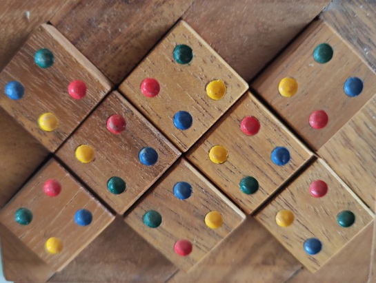

.. _l-puzzle_2:

Résolution d'un autre puzzle
============================

.. contents::
    :local:

Pour la petite histoire
+++++++++++++++++++++++

Ce puzzle m'est parvenu par mail...

Il ne contient que huit pièces, chacune d'elle est carrée
avec quatre angles de couleurs différentes qu'il faut
selon une disposition.

.. raw:: html

    <video autoplay="" controls="" loop="" height="500">
    <source src="http://www.xavierdupre.fr/enseignement/complements/puzzle_2.mp4" type="video/mp4" />
    </video>
