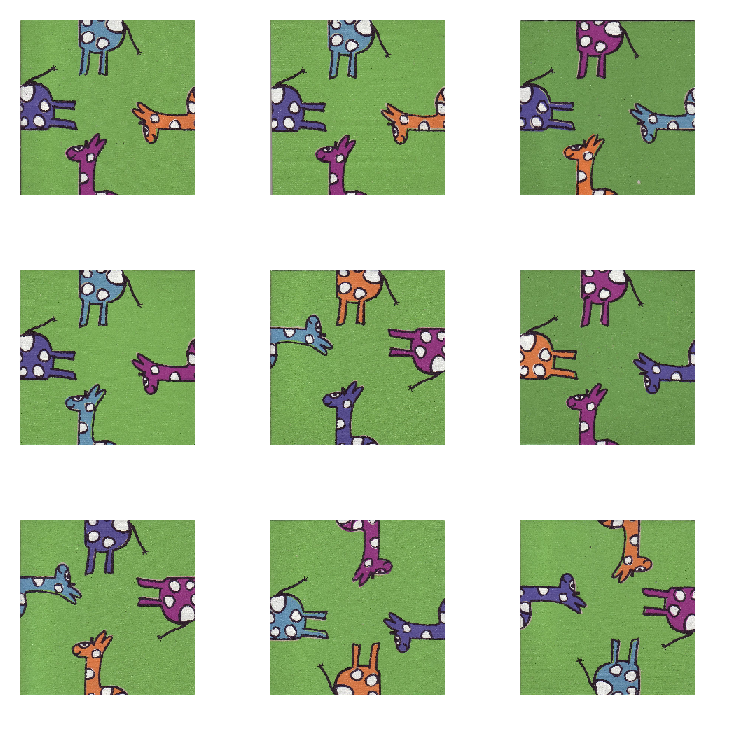
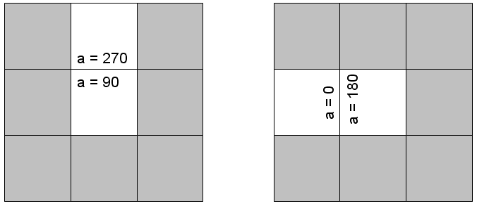
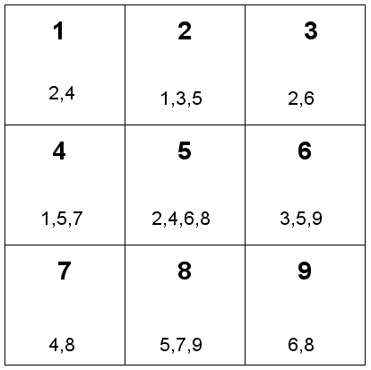
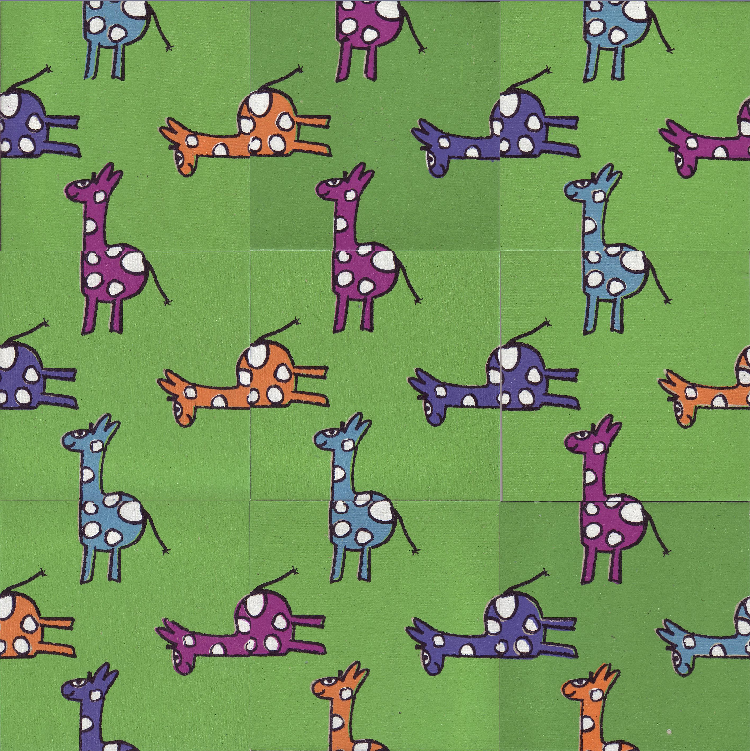
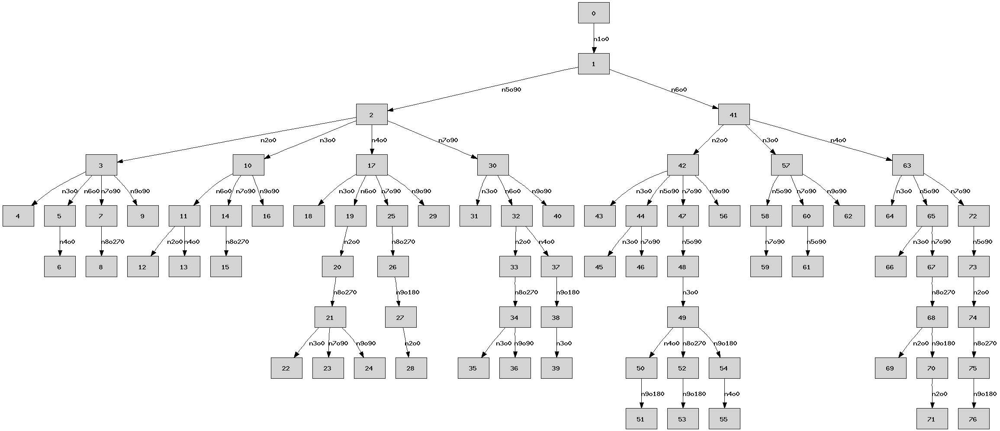

.. _l-puzzle_girafe:

Résolution d'un puzzle
======================

C'est un cadeau que j'ai reçu à Noël il y a longtemps sous forme de puzzle.
A vrai dire, je n'ai même pas essayé de résoudre le puzzle moi-même.
Mais je me suis qu'en scannant les pièces du puzzle (au nombre de neuf), 
je devrais être en mesure d'écrire un programme pour le résoudre à ma place. 
Ce document décrit comment je m'y suis pris. D'abord les pièces.

Il ne contient que neuf pièces, chacune d'elle est carrée et chaque côté est soit la tête, 
soit les jambes d'une girafe pour lesquelles il y a quatre couleurs possibles. 
L'appariement des pièces ne dépend que des motifs sur les bords de chaque pièce 
et non de leur forme. La forme finale du puzzle - un grand carré - est connue. 
Même s'il paraît simple, il existe un grand nombre d'arrangements possibles : 
il existe *9!* façons possibles de placer chaque pièce et à chaque position, 
chaque pièce peut être tournée 4 fois. Nous oublierons volontairement les symétries 
car il plus difficile d'en tenir compte dans un programme informatique 
que de faire l'impasse dessus.

Avant de pouvoir construire la résolution du puzzle, il faut tout d'abord 
décrire les éléments qui le compose afin de pouvoir les manipuler. 
C'est l'objet du paragraphe suivant.

Description des pièces
++++++++++++++++++++++

La description des données suggère deux problèmes. Le premier est l'acquisition 
et le second leur représentation au sein du programme informatique. Un 
rapide coup d'oeil sur les images et on détecte facilement 
qu'il existe 2x4=8 différents bords possibles et qu'une pièce peut simplement 
être décrite par la donnée de ces quatre bords. Mais les obtenir depuis 
l'image directement fait appel à des techniques de traitements 
d'images qui seraient trop longues à mettre en place. Il est beaucoup plus 
simple de construire un fichier texte dans lequel seront stockées les 
informations utiles concernant chaque pièce.

Il n'existe pas de manière unique de décrire un bord, le moyen envisagé 
est le suivant : chaque pièce va être décrite par une chaîne de huit caractères, 
4x2 pour être exacte. Chaque bord est décrit par deux lettres, la première 
H ou B désigne le haut ou le bas de la girafe. La seconde lettre M, O, B ou V 
désigne la couleur mauve, orange, bleu ou violet. Par exemple, la première 
pièce ``HOBBBVHM`` possède quatre bords définis comme suit :

* HO = haut orange
* BB = bas bleu
* BV = bas violet
* HM = haut mauve

Mises bout à bout, les descriptions des neuf pièces :

::

    HOBBBVHM
    HOBBBVHM
    HBBMBVHO
    HMBBBVHB
    BMBOHBHV
    HVBMBOHM
    BMBVHBHO
    HVHMBBBO
    BMHOHVBB

Il ne reste plus qu'à écrire un petit bout de code capable de lire ce fichier 
puis de construire chaque pièce. Mais avant cela, il faut imaginer une représentation 
informatique de ces données qui va recevoir l'information lue depuis les chaînes de caractères. 

Les classes ne sont pas indispensables d'autant plus que aucun héritage 
ne sera nécessaire dans ce cas présent. Toutefois, elles simplifient 
la description de chaque pièce : le puzzle comporte neuf pièces qui chacune possède 
quatre bords. Le programme contiendra trois classes : 
:class:`PuzzleGirafeBord <ensae_teaching_cs.special.puzzle_girafe.PuzzleGirafeBord>`, 
:class:`PuzzleGirafePiece <ensae_teaching_cs.special.puzzle_girafe.PuzzleGirafePiece>`, 
:class:`PuzzleGirafe <ensae_teaching_cs.special.puzzle_girafe.PuzzleGirafe>`, 
Ces trois classes contiendront à la fois des données et des méthodes qui 
s'appliquent à ces données.

Bord
++++

La classe :class:`PuzzleGirafeBord <ensae_teaching_cs.special.puzzle_girafe.PuzzleGirafeBord>`
ne contient que deux attributs, *partie* qui désigne la partie du corps de la girafe 
et *couleur*, sa couleur. Ce sont les seules données. Il n'y a pas besoin de 
données supplémentaires pour dire si deux bords peuvent être appariés, 
ce sera la méthode 
:meth:`compatible <ensae_teaching_cs.special.puzzle_girafe.PuzzleGirafeBord.compatible>`
et incluse dans la classe :class:`PuzzleGirafeBord <ensae_teaching_cs.special.puzzle_girafe.PuzzleGirafeBord>`. 
Deux bords pourront seront compatibles s'ils ont la même couleur et des parties opposées.

:: 

def compatible (self, bord) :
        return self.couleur == bord.couleur and self.partie != bord.partie

Piece
+++++

Une pièce est tout d'abord composée de quatre bords, la classe 
:class:`PuzzleGirafePiece <ensae_teaching_cs.special.puzzle_girafe.PuzzleGirafePiece>`
doit nécessairement contenir une liste de quatre instances de la classe 
:class:`PuzzleGirafeBord <ensae_teaching_cs.special.puzzle_girafe.PuzzleGirafeBord>`.
La seule difficulté consiste à préciser à quel bord de la pièce correspond le premier 
bord de la liste. On décide de tourner dans le sens trigonométrique. 

+--------------+--------------+--------------+
|              | ``bord [1]`` |              |
+--------------+--------------+--------------+
| ``bord [2]`` |              | ``bord [0]`` | 
+--------------+--------------+--------------+
|              | ``bord [3]`` |              |
+--------------+--------------+--------------+

La description d'une pièce fait également intervenir sa position et 
son orientation (le fait de tourner la pièce de 0,90,180 ou 270 degrés) 
par rapport à sa description d'origine. Ce ne sont pas des informations 
immuables, elles seront le résultat de la résolution du puzzle mais il faut 
décider où placer ces informations : au sein de la classe 
:class:`PuzzleGirafePiece <ensae_teaching_cs.special.puzzle_girafe.PuzzleGirafePiece>`
ou au sein de la classe 
:class:`PuzzleGirafe <ensae_teaching_cs.special.puzzle_girafe.PuzzleGirafe>`. 
Il n'y a pas de meilleur choix, tout dépend de la manière de rédiger l'algorithme 
ou de comment ces classes seront utilisées par la suite. 
Dans notre cas, le choix est de les insérer dans la classe 
:class:`PuzzleGirafePiece <ensae_teaching_cs.special.puzzle_girafe.PuzzleGirafePiece>`, 
ce seront les attributs *orientation* et *position*. 
Ce dernier mérite un peu plus d'attention car son type sera entier et 
non un t-uple de deux entiers.

La position pourrait être décrite grâce à deux coordonnées entières mais le sera grâce à 
un seul entier. On obtient les coordonnées comme ceci 
d'après la position :math:`n \in \left\{1,...,0 \right\}` :

.. math::

    \begin{array}{rcl} x & = & (n-1 \mod 3) + 1 \\ y & = & \left[\frac{n-1}{3}\right] + 1  \end{array}
        
Réciproquement, la position *n* est obtenue à partir des coordonnées 
:math:`(x,y) \in \left\{1,...,3\right\}^2` :

.. math::

    n = (y-1) * 3 + x 
    
La position est un entier dans l'ensemble :math:`\left\{1,..,9\right\}`.
Lors de la résolution, certaines pièces seront placées et d'autres pas encore. 
La convention choisie pour une pièce non encore placée est de lui affecter 
une position nulle. Dans ce cas, l'orientation n'a pas d'importance.

La connaissance de l'orientation et de la position de deux pièces permet 
également de savoir si elles peuvent être voisines étant donné 
le motif de leur bord conjoint s'il existe. 
Ce sera l'objectif de la méthode 
:meth:`voisin_possible <ensae_teaching_cs.special.puzzle_girafe.PuzzleGirafePiece.voisin_possible>`
qui retourne ``True`` si les deux pièces font bon ménage ensemble. 
Le premier test porte sur les positions des pièces et de savoir si elles sont 
effectivement voisines. Pour cela, on calcule la différence *d* des positions. 
Les deux pièces sont voisines si *d* est égale à 1 ou -1 et si les pièces sont 
sur la même ligne ou que *d* est égale à 3 ou -3.

::

    def voisin_possible (self, p, a) :
        d = p.position - self.position
        if abs (d) == 1 and (p.position - 1) // 3 == (self.position - 1) // 3 :
            # voisin en x
            return True
        elif abs (d) == 3 :
            # voisin en y
            return True
        else :
            # pas voisin
            return False

Une fois cette condition vérifiée, il reste à vérifier que le bord qu'elles 
ont en commun ont des motifs appariés. Il faut donc dans un premier temps 
savoir quels sont les deux bords en contact. Il faut d'abord les nommer, 
ils seront appelés bord 0, 90, 180, 270 en tournant dans le sens trigonométrique. 
Lorsqu'on tourne la pièce de 90 degrés, le 0 est à la place du bord 90. 
En tenant compte de l'orientation, on peut calculer l'indice *a'* qui tient compte 
de l'orientation *o*. Soit :math:`a \in \left\{0,90,180,270\right\}` 
le nom du bord cherché et :math:`o \in \left\{0,90,180,270\right\}` l'orientation 
de la pièce, dans ce cas :math:`a' = \frac{(a - o + 360) \mod 360}{90} \in \left\{0,1,2,3\right\}`
est l'indice du bord cherché.

.. math::

    \begin{array}{c|c|c} & \girafedec{0}{90}{90} & \\ \hline 
    \girafedec{90}{180}{90} &  
            \begin{array}{c} piece \\ tournee de \\ 90 degres \end{array} &  
                    \girafedec{270}{360}{90} \\ \hline  
    & \girafedec{180}{270}{90} &  \end{array}
    
C'est la correspondance entre *a*, *o*, *a'* lorsqu'une pièce est 
tournée de 90 degrés dans le sens trigonométrique. 
Deux pièces sont voisines si elles sont à gauche et droite l'une de l'autre (premier cas) 
ou en haut et bas l'une de l'autre (second cas). 

Le dessin permet de trouver les paires d'indices
*a'* qui correspondent aux bords en contact, et connaissant l'orientation 
de chaque pièce, les indices *a* des bords en contact. 
La méthode \codes{compatible} de l'un des deux bords dira si effectivement 
les deux bords en contact sont appariés.
Deux pièces sont voisines en *x* ou en *y*. 
Les bords voisins sont dans le premier cas 0 et 180, dans le second, 
90 et 270 (indices *a'*). 

Les autres méthodes de la classe 
:class:`PuzzleGirafePiece <ensae_teaching_cs.special.puzzle_girafe.PuzzleGirafePiece>`
concernent l'affichage et la création des pièces à partir du format 
décrit précédemment et stocké dans un fichier texte. 
Les autres attributs sont également liés à l'affichage, 
un nom de fichier, et deux images. Leur utilisation sera décrite au 
paragraphe suivant.

Puzzle
++++++

Avant de construire de chercher à résoudre le problème, 
il faut s'interroger sur la forme du résultat que l'on cherche. 
Dans le cas de ce puzzle, ce peut être une liste de 9 pièces et 
pour chacune d'entres elles, les attributs *position* et *orientation* 
doivent être renseignés ; c'est à dire être compris en 1 et 9 pour la position et 
dans l'ensemble :math:`\acc{0,90,180,270}` pour l'orientation.

La classe 
:class:`PuzzleGirafe <ensae_teaching_cs.special.puzzle_girafe.PuzzleGirafe>` 
contiendra donc une liste de 
:class:`PuzzleGirafePiece <ensae_teaching_cs.special.puzzle_girafe.PuzzleGirafePiece>`
précédemment décrite et incluera les méthodes nécessaires à la résolution du puzzle. 
La description du principe général de la résolution interviendra après celles 
de méthodes simples de la classe 
:class:`PuzzleGirafe <ensae_teaching_cs.special.puzzle_girafe.PuzzleGirafe>`.

:meth:`piece_position <ensae_teaching_cs.special.puzzle_girafe.PuzzleGirafe.piece_position>`

La liste résultante n'est pas forcément ordonnée en ce sens que la pièce en première position 
dans la liste n'est pas forcément la première pièce du puzzle. 
C'est l'attribut *position* de chaque pièce qui détermine la position de celle-ci. 
La méthode 
:meth:`piece_position <ensae_teaching_cs.special.puzzle_girafe.PuzzleGirafe.piece_position>`
retourne la pièce à une certaine position donnée ou 
``None`` si l'algorithme n'a pas encore posé de pièce à cet endroit.

::

    def piece_position (self, pos) :
        for p in self.piece :
            if p.position == pos :
                return p
        return None

:meth:`ensemble_voisin <ensae_teaching_cs.special.puzzle_girafe.PuzzleGirafe.ensemble_voisin>`

Cette méthode a pour objectif de retourner la liste des positions voisines à une 
position donnée.

::

    def ensemble_voisin (self, i) :
        i -= 1
        res = []
        for x in [-1,0,1] :
            for y in [-1,0,1] :
                if abs (x) == abs (y) : continue
                if x == -1 and i % 3 == 0 : continue
                if x == 1  and i % 3 == 2 : continue
                if y == -1 and i / 3 == 0 : continue
                if y == 1  and i / 3 == 2 : continue
                j = i + x + y * 3
                if j in range (0,9) :
                    res.append (j)
        return [ j+1 for j in res ]

:meth:`angle_possible <ensae_teaching_cs.special.puzzle_girafe.PuzzleGirafe.angle_possible>`

Il s'agit ici de déterminer une orientation possible pour la pièce ``p`` sachant 
qu'elle est à la position ``p.position``. Dans ce cas, on détermine l'ensemble 
des positions voisines à ``p.position``, puis l'ensemble des pièces posées sur 
ces cases voisines. Il ne reste plus qu'à déterminer pour une pièce toutes 
les orientations qui ne dérogent pas à la règle des appariements de côtés. 
La fonction retourne une liste d'au plus quatre éléments et vide si 
une pièce ne peut être placée à la position ``p.position`` dans quelque orientation que ce soit.

::

    def angle_possible (self, p, display = False) :
        voisin = self.ensemble_voisin (p.position)
        if display :
            print "voisin = ", voisin
        res = []
        for a in [0,90,180,270] :
            r = True
            for v in voisin :
                piece = self.piece_position (v)
                if piece != None :
                    r = r and piece.voisin_possible (p, a)
            if r :
                res.append (a)
        return res

Résolution
++++++++++

La description des éléments du puzzle est terminée ainsi que quelques manipulations 
simples. Avant d'entamer la résolution proprement dite, il est sans doute 
utile de préciser la complexité du problème souvent exprimée par l'étendue 
de l'ensemble des solutions. Chaque pièce doit être placée à une position 
donnée parmi 9 dans une orientation donnée parmi 4. Avec 9! permutations, il y a donc 
potentiellement :math:`9! 4^9 = 18.874.368` solutions envisageables et pour 
chacune d'elles, il suffit qu'un appariement ne soit pas possible pour 
que la solution n'en soit pas une.

Il est possible d'explorer l'ensemble des solutions avec les ordinateurs 
de bureau actuels. Avec 16 pièces, ce serait encore très long 
(de l'ordre de :math:`10^{23}`. En théorie, l'algorithme proposé ne réduit 
pas forcément le nombre de solutions à explorer, ceci dépend entre 
autres de l'ordre initial des pièces. En pratique, il permet souvent 
d'éliminer des sous-ensembles de solutions. Par exemple, supposons que 
cinq pièces soient déjà placées aux positions 1 à 5. S'il n'est pas possible de 
placer aucune des autres pièces à la position 6 dans quelque orientation que 
ce soit, aucune des solutions avec ces cinq pièces ne marchera, 
soit 6144 solutions non essayées grâce à quelques tests.

La résolution du puzzle passe par la construction d'une fonction récurrente 
qui s'inspire de celle qu'on utilise pour construire l'ensemble des permutations de 
:math:`\acc{1,...,n}`.

Permutations
++++++++++++

Il est assez intuitif de construire par récurrence l'ensemble des permutations de 
:math:`\acc{1, ..., n}` à l'instar de la fonction factorielle. Parmi les *n!* permutations, 
il y a extactement *(n-1)!* permutations avec le nombre 1 en première 
position, il y a aussi *(n-1)!* avec le nombre 2 en première position et 
ainsi de suite. En s'aidant de cette constatation, on cherche à construire 
la fonction ``permutation(n)`` qui retourne la liste des permutations de l'ensemble 
:math:`\acc{1, ..., n}` par récurrence.

On note :math:`P_n` les permutations de l'ensemble :math:`\acc{1,...,n}`. 
Les premières *(n-1)!* permutations sont celles où le premier nombre 1 est 
fixé en première position et où on applique les permutations :math:`P_{n-1}` 
à l'ensemble restant :math:`\acc{2,...,n}`. Les permutations suivantes sont 
celles où on permute 1 avec 2 et où on applique les permutations à l'ensemble 
:math:`\acc{1,3,4,...,n}`. On obtient en continuant ce raisonnement :

+---------------------------------+----------------------------------------------------------------------+
| première vague de permutations  | 1 + permutations appliquées à :math:`\acc{2,3,4,5, ..., n}`          |
+---------------------------------+----------------------------------------------------------------------+
| seconde vague de permutations   | 2 + permutations appliquées à :math:`\acc{\mathbf{1},3,4,5, ..., n}` |
+---------------------------------+----------------------------------------------------------------------+
| troisième vague de permutations | 3 + permutations appliquées à :math:`\acc{2,\mathbf{1},4,5 ..., n}`  |
+---------------------------------+----------------------------------------------------------------------+
| quatrième vague de permutations | 4 + permutations appliquées à :math:`\acc{2,3,\mathbf{1},5 ..., n}`  |
+---------------------------------+----------------------------------------------------------------------+
| ....                            |                                                                      |
+---------------------------------+----------------------------------------------------------------------+

Le programme complet aboutit à :

::

    def echange (l, i, j) :
        """permutation des éléments i et j de la liste l"""
        t       = l [i]
        l [i]   = l [j]
        l [j]   = t
        
    def applique_permutation (set, p) :
        """applique la permutation p à l'ensemble set"""
        return [ set [k-1] for k in p ] 
        
    def permutation (n) :
        if n == 1 : return [ [ 1 ] ]
        else :
            per = permutation (n-1)             # permutation sur {1,...,n-1}
            set = [ i+1 for i in range (0,n) ]  # ensemble de départ
            res = []                            # résultat
            
            for i in range (0, n) :
                echange (set, 0, i)             # échange élément 0 et i
                for p in per :                  # boucle sur les permutations de {1,...,n-1}
                    pr  = [ set [0] ] + applique_permutation ( set [1:], p )
                    res.append (pr)             # on l'ajoute au résultat
                echange (set, 0, i)             # échange élément 0 et i
                
            return res
            
    print (permutation (1)) # retourne [ [ 1 ] ]
    print (permutation (2)) # retourne [[1, 2], [2, 1]]
    print (permutation (3)) # retourne [[1, 2, 3], [1, 3, 2], [2, 1, 3], [2, 3, 1], [3, 2, 1], [3, 1, 2]]

Application au puzzle
+++++++++++++++++++++

Il serait simple d'utiliser le programme précédent pour construire l'ensemble des 
permutations puis de le parcourir en changeant pour chacune d'entre elles les 
orientations de chaque pièce mais ce système nous ferait évaluer l'ensemble des 
solutions possibles sans possibilité de le réduire comme suggéré précédemment. 
Il vaut mieux reprendre le programme précédent et remplacer la fonction 
``permutation`` de sorte qu'elle explore les solutions au lieu de les retourner comme résultat.

Le principe de la résolution repose sur la récurrence de la méthode 
\codes{solution}. 
Il y a 4x9 possibilités pour le choix en première position. 
La méthode 
:meth:`solution <ensae_teaching_cs.special.puzzle_girafe.PuzzleGirafe.solution>`
en choisit une puis appelle la méthode 
:meth:`solution <ensae_teaching_cs.special.puzzle_girafe.PuzzleGirafe.solution>`
sur la seconde position, si celle-ci retourne ``True`` alors ce premier 
choix était le bon, sinon on passe au choix suivant. 
Au second appel, une pièce est choisie pour la seconde position puis on 
appelle encore la méthode 
:meth:`solution <ensae_teaching_cs.special.puzzle_girafe.PuzzleGirafe.solution>`.
Le schéma est le suivant :

* On calcule la liste des choix pour la position *p*.
* Si cet ensemble est vide, on retourne ``False``, 
  il n'y a pas de solution possible dans cette voie.
* Sinon on choisit la première possibilité.
* On appelle la méthode 
  :meth:`solution <ensae_teaching_cs.special.puzzle_girafe.PuzzleGirafe.solution>`
  pour la position :math:`p+1`.
* Si cette méthode retourne ``True``, une solution a été trouvée.
* Sinon, on passe au choix suivant jusqu'à ce qu'il n'y en ait plus.

L'implémentation proposée ne suit pas tout-à-fait ce schéma puisqu'on ne calcule pas 
l'ensemble des choix possibles au début de la méthode 
:meth:`solution <ensae_teaching_cs.special.puzzle_girafe.PuzzleGirafe.solution>`
mais on calcule un premier choix 
:meth:`meilleur_choix <ensae_teaching_cs.special.puzzle_girafe.PuzzleGirafe.meilleur_choix>`
en tenant des compte des pièces déjà placées dans la liste ``free``. 
Si la solution finale utilise cette pièce, c'est terminé sinon, la fonction 
:meth:`meilleur_choix <ensae_teaching_cs.special.puzzle_girafe.PuzzleGirafe.meilleur_choix>`
est appelée une seconde fois pour obtenir un second choix de pièce en tenant 
compte des pièces placées et essayées. 

On peut représenter les appels dus à la récursion sous forme de graphe.
Chaque noeud représente un nouvel appel à la méthode \codes{solution}. 
Chaque noeud est relié par un arc au noeud précédent l'ayant appelé. 
Une branche - le chemin depuis la racine jusqu'à une feuille - longue de moins de 9 noeuds 
signifie qu'une contradiction est apparue avant de placer toutes les pièces, 
ceci signifie qu'il n'était pas nécessaire d'explorer toutes les branches passant 
par les derniers noeuds intermédiaires. 
Une branche de 9 noeuds signifie que la contradition est apparue sur la dernière 
pièce et une seule branche de 9 noeuds a mené à la solution trouvée.

La résolution du puzzle en vidéo :

.. raw:: html

    <video autoplay="" controls="" loop="" height="500">
    <source src="http://www.xavierdupre.fr/enseignement/complements/puzzle_girafe.mp4" type="video/mp4" />
    </video>

