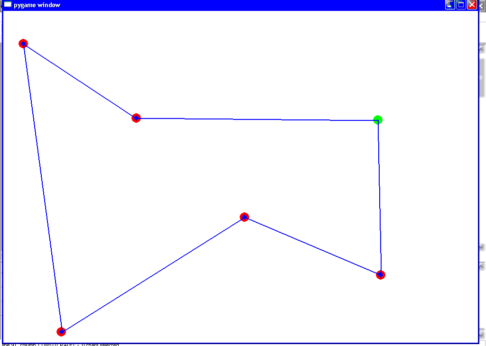
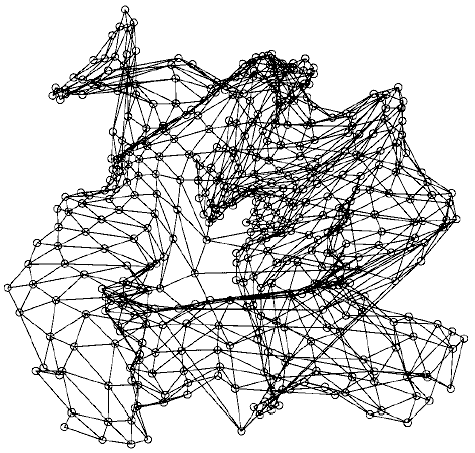

.. _l-tsp_kohonen:

Circuit hamiltonien et Kohonen
==============================

Aperçu
++++++

Le problème du voyageur de commerce est un problème classique, aussi connu sous le nom de 
`travevelling salesman problem <https://en.wikipedia.org/wiki/Travelling_salesman_problem>`_. 
Le voyageur de commerce doit effectuer la tournée de 
ses magasins le plus rapidement possible. Il doit donc déterminer un chemin passant par 
toutes les villes qui soit le plus court possible. 

Cette problématique se retrouve également dans d'autres domaines comme la plannification de tâches. 
Par exemple, une machine doit effectuer un certain nombre de travaux, 
l'ordre dans lequel elle les traite importe peu, on demande simplement que le temps de 
traitement de l'ensemble des tâches soit le plus court possible. Cependant, 
avant toute tâche, cette machine doit être préparée et le temps de préparation dépend 
des tâche précédente et suivante. Ce problème ressemble à celui du voyageur de 
commerce, les temps de préparation entre deux tâches jouent le rôle de distance.

Il existe plusieurs algorithmes pour déterminer ce plus court chemin. 
Deux seront présentés. Le premier est celui des cartes de 
`Kohonen <https://en.wikipedia.org/wiki/Self-organizing_map>`_, 
il s'applique de préférence à un nombre de villes inférieur à un ou deux centaines. 
Au delà, lorsque les villes sont trop proches des unes des autres, cet algorithme retourne 
une solution où les erreurs apparaissent de manière évidente. 
La seconde méthode est plutôt utilisée pour la recherche du plus court chemin pour 
des graphes contenant un grand nombre de villes. Pour ces grands graphes, les 
cartes de Kohonen convergent lentement. Le plus court chemin est en fait une permutation 
de l'ensemble des villes, les deux méthodes proposées sont deux manières 
différentes d'explorer l'ensemble des permutations possibles.

.. image:: checour300.png
    :height: 300

*Plus court chemin passant par les 300 villes, solution retournée par l'algorithme
de Kohonen. Certaines erreurs cerclées de noir sont évidentes comme deux segments du 
chemin qui se croisent. Celles-ci sont néanmoins facile à corriger une fois
que la solution a convergé.*

Obtenir le plus court chemin passant par tous les sommets d'un graphe est un 
problème d'optimisation avec contrainte. C'est un problème dit *NP-complet* 
Le site `The Traveling Salesman Problem <http://www.math.uwaterloo.ca/tsp/index.html>`_
est dédié à ce problème. Il référence des articles, quelques solutions à des problèmes 
géographiques comme le plus court chemin reliant toutes les villes de Suède. 
Il référence également une librairie écrite en~C proposant divers algorithmes 
permettant de résoudre le problème du voyageur de commerce.

    Un problème est dit NP-complet s'il n'existe aucun algorithme de coût polynômial
    permettant d'obtenir une solution optimale.

Le problème du voyageur de commerce appartient à une classe de problème plus vaste appelée 
*optimisation combinatoire*. Pour ce type de problème, 
l'ensemble des solutions possibles est discret et non continu
(voir `A backbone based TSP heuristic for large instances <https://www.researchgate.net/publication/259174142_A_backbone_based_TSP_heuristic_for_large_instances>`_).

Cartes de Kohonen
+++++++++++++++++

Les cartes de Kohonen sont utilisées pour réaliser la projection d'un nuage de points 
sur un espace de dimension moindre. Dans le cas du problème du voyageur de commerce, 
il s'agit de projeter un nuage de points inclus dans un espace à deux dimensions vers 
un espace à une dimension. Chaque ville recevra une coordonnée~: son ordre dans le 
chemin le plus court. Les cartes de Kohonen sont plus fréquemment utilisées pour 
projeter un nuage de points inclus dans un espace à :math:`n > 2` dimensions vers un espace 
à deux dimensions, soit un espace qui puissent être représenté graphiquement.
Ceci explique leur désignation de cartes de Kohonen ou en anglais *Self Organized Map (SOM)*. 
Le document \citeindex{Koivisto1999} (voir aussi \citeindex{Vesanto2000}) 
regroupe plusieurs articles à propos de diverses techniques et 
diverses utilisations des cartes de Kohonen dans des problèmes tels 
que la reconnaissance de la parole, les modèles de Markov cachés, 
la recherche de mot-clé dans un texte, l'analyse en composantes principales (ACP).

.. image:: som1.png
    :height: 300

Exemple de cartes de Kohonen après convergence. Il s'agit de projeter dans un plan
un nuage de points en trois dimensions.	Chaque neurone possède six voisins. Plane au départ,
la carte se déforme pour s'adapter au nuage de points qu'elle doit modéliser. La seconde
carte est plus déformée que la première et présente quelques torsions qui ressemblent à un
papillon. Ces figures sont tirées de l'article 
`Clustering of the Self-Organizing Map <http://lib.tkk.fi/Diss/2002/isbn951226093X/article4.pdf>`_.

On suppose qu'un chemin est constitué de points ou neurones, 
différents ou non des villes, chacun étant reliés à ses deux voisins. 
L'idée principale de l'algorithme consiste à faire en sorte que chaque 
villes tire vers elle un neurone et ses voisins. Au cours des itérations 
successives, la longueur du chemin s'agrandit et il se rapproche peu à 
peu des villes jusqu'à que chaque ville soit rejointe par un neurone.

    On note *n* villes par :math:`\vecteur{v_1}{v_n} \in \pa{\R^k}^n` 
    avec :math:`k \supegal 2`. Un chemin de longueur *l*
    est noté :math:`\vecteur{p_1}{p_l} \in \pa{\R^k}^l`, 
    on suppose que les voisins du neurone :math:`p_i` sont les neurones
    d'indices :math:`(i-1) \mod l` et :math:`(i+1) \mod l`. 
    La fonction :math:`d : \R^k \times \R^k \longrightarrow \R` 
    désigne une distance.
    
    **initialisation**
    
    Le chemin est constitué de trois neurones placés autour du barycentre de l'ensemble 
    :math:`\vecteur{v_1}{v_n}`,
    *t* compte le nombre d'itérations. 
    
    **étape 1**
    
    On définit le vecteur :math:`\vecteur{c_1}{c_l} = 0`
    et :math:`t \longleftarrow t + 1`
    
    Pour *i* allant de *1* à *n*
    
        On détermine l'indice :math:`j^*` du neurone le plus proche de la ville *i*. 
        
        .. math::
        
            \begin{array}{lll} c_{j^*} &\longleftarrow& c_{j^*} + 1 \\ p_{j^*} &\longleftarrow& p_{j^*} + 
            \epsilon \pa{t, d\pa{ v_i, p_{j^*} }} \;\; \cro{ v_i - p_{j^*}} \end{array}
            
        On met à jour chacun des voisins *q* de :math:`p_{j^*}` de la façon suivante : 
        :math:`q \longleftarrow q + \eta \pa{t, d\pa{ v_i, p_{j^*}}, d\pa{q, p_{j^*}}} \;\; \cro{ v_i - p_{j^*}}`.
    
    **étape 2**
    
    Pour chaque neurone d'indice *i* du chemin, si :math:`c_i = 0` alors il est supprimé. 
    Ceci signifie qu'aucune ville ne l'a choisi. Dans le cas contraire, 
    si :math:`c_i \supegal 2`, plus d'une ville l'a choisi, le neurone est dupliqué. 
    C'est-à-dire qu'un autre neurone est inséré dans le chemin et placé à proximité du neurone dupliqué. 
    
    Tant que les neurones bougent encore, on retourne à l'étape 1.

Afin que l'algorithme converge, on choisit des fonctions 
:math:`\epsilon \pa{t, x}` et :math:`\eta \pa{t, x}` décroissantes par 
rapport à *t*. Il est conseillé de choisir des fonctions qui vérifient :

.. math::

    \begin{array}{rcl} \forall x \in \R^+, \;&& \sum_{t=1}^{\infty} \epsilon \pa{t,x} = \infty 
    \text{ et }\sum_{t=1}^{\infty} \epsilon^2 \pa{t,x} < \infty \\
    \forall t,x,y \in \N \times \R^+ \times \R^+, \; && \eta \pa{t,x,y} < \epsilon \pa{t,x}
    \end{array}

On peut choisir par exemple :

.. math::

    \begin{array}{rcl} \epsilon\pa{t,x} &=& \frac{\epsilon_0}{1+t} \; \frac{d_0}{d_0 + x} \\
    \eta\pa{t,x} &=& \frac{\eta_0}{1+t} \; \epsilon\pa{t,x} \end{array}
			
Il est souvent utile d'effectuer plusieurs essais pour déterminer les valeurs 
:math:`\epsilon_0`, :math:`\eta_0`, :math:`d_0`. Ces fonctions peuvent 
également dépendre d'autres paramètres tels que l'angle formé par un neurone 
et ses deux voisins. Il est aussi possible qu'une ville attire un neurone, 
ses deux neurones les plus proches puis encore d'autres voisins plus éloignés. 
Il n'existe pas de fonction optimale, elles dépendent du problème à résoudre. 

Pour améliorer la convergence de l'algorithme, plutôt que de considérer à 
l'étape 2 les villes toujours dans le même ordre, elles sont toutes passées 
en revue dans un ordre aléatoire et différent à chaque itération. 
Cette modification permet de relancer plusieurs fois l'algorithme 
pour choisir au final le chemin de plus courte longueur.

La suppression et l'insertion de neurones est facile à concevoir lorsque la carte de Kohonen 
n'est qu'un chemin à une dimension. Lorsqu'il s'agit d'un maillage à deux 
dimensions, cette étape n'est pas incluse. L'initialisation consiste alors à placer 
un nombre de neurones fixe puis à appliquer l'étape 2. 
Le voisinage est simplement plus étendu.

Le coût de cet algorithme dépend de la vitesse de convergence. 
Toutefois, l'étape 2 a un coût de :math:`n^2` où *n* est le nombre de villes, 
coût à multiplier par le nombre d'itérations. Les paragraphes qui suivent 
proposent un autre algorithme permettant de construire une solution pour 
le problème du voyageur de commerce. Il est beaucoup plus 
rapide mais il explore davantage l'ensemble des solutions.

Code : :mod:`ensae_teaching_cs.special.tsp_kohonen`.

En vidéo :

.. raw:: html

    <video autoplay="" controls="" loop="" height="250">
    <source src="http://www.xavierdupre.fr/enseignement/complements/tsp_kohonen.mp4" type="video/mp4" />
    </video>

