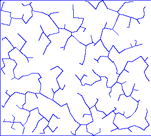
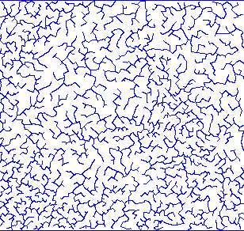
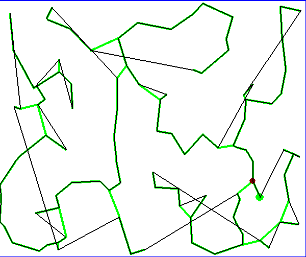
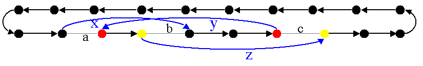
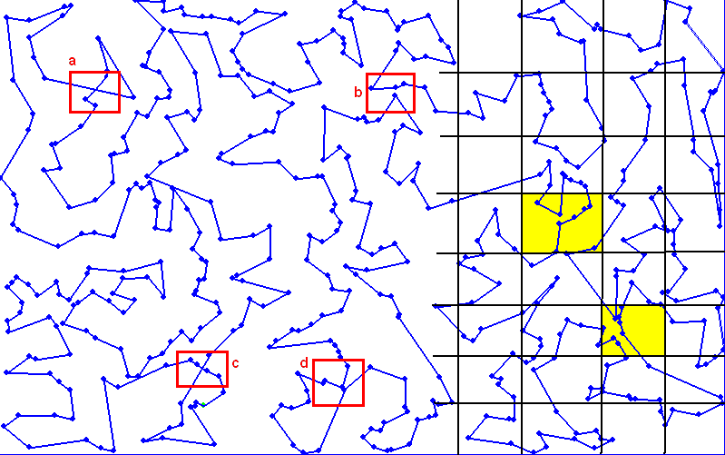

.. _l-tsp_kruskal:

Circuit hamiltonien et Kruskal
==============================

Le module :mod:`tsp_kruskal <ensae_teaching_cs.specials.tsp_kruskal>` implémente l'algorithme
ci-dessus.

Arbre de poids minimal et circuit hamiltonien
+++++++++++++++++++++++++++++++++++++++++++++

Ce paragraphe décrit un algorithme permettant de construire un 
chemin dont on espère qu'il sera le plus court. Il part d'un 
ensemble de villes pour construire un *circuit hamiltonien*.
Cet algorithme utilise deux chemins d'un type particulier, 
`eulérien <https://fr.wikipedia.org/wiki/Graphe_eul%C3%A9rien>`_ et 
`hamiltonien <https://fr.wikipedia.org/wiki/Graphe_hamiltonien>`_.

    Un chemin eulérien d'un graphe est un chemin passant par tous les arcs de ce graphe.
    Un circuit eulérien est un chemin eulérien dont les n\oe uds de départ et d'arrivée sont identiques.

    Un chemin hamiltonien d'un graphe est un chemin passant par tous les n\oe uds de ce graphe.
    Un circuit hamiltonien est un chemin hamiltonien dont les n\oe uds de départ et d'arrivée sont identiques.

La première étape de l'algorithme consiste à construire un arbre de poids minimum.
Si le chemin doit parcourir *n* villes, cette première étape permet de 
réduire l'ensemble des arcs possibles :math:`\frac{n(n-1)}{2}` 
à un multiple de *n*.

    On suppose qu'il faut déterminer le plus court chemin passant par *n* villes. 
    L'algorithme se décompose en quatre étapes :

    * construction de l'arbre de poids minimum
    * construction d'un circuit eulérien
    * construction d'un circuit hamiltonien
    * simplification du circuit hamiltonien

Le circuit eulérien parcourt tous les arcs de poids minimal et 
passe donc plusieurs fois par le même sommet. En enlevant les sommets 
redondants, on obtient un circuit hamiltonien qui est 
une solution pour le problème du voyageur de commerce. 
L'avantage de cet algorithme est son coût, multiple du nombre de villes.

Arbre de poids minimum
++++++++++++++++++++++

Obtenir l'arbre de poids minimum est encore un problème 
d'optimisation avec contrainte. Il s'agit de réduire 
l'ensemble des arcs tout en conservant un graphe composé 
d'une seule composante connexe.

    Une composante connexe *C* d'un graphe est un ensemble de noeuds 
    tel que pour tout couple de noeuds 
    :math:`(s,t) \in C^2`, il existe un chemin allant de 
    *s* à *t* dont tous les n\oe uds intermédiaires sont
    inclus dans *C*.
		
Il est maintenant possible d'exprimer la contrainte liée au 
problème de l'arbre de poids minimum.		
		
    Soit un graphe *G=(X,E)*, un arbre de poids minimum
    :math:`G^*=\pa{X^*, E^*}` est un sous-arbre de *G* qui vérifie :
    
    * :math:`X^* = X`, le graphe de poids minimum partage les mêmes 
      sommets que le graphe initial.
    * :math:`E^* \subset E`, les arcs graphe de poids minimum possède 
      forme un sous-ensemble de l'ensemble des arcs du graphe initial.
    * La somme des poids des arcs de :math:`E^*` est minimale.
    * Le graphe :math:`G^*` contient autant de composantes 
      connexes que le graphe initial.
		
L'algorithme qui suit n'est pas le seul permettant d'obtenir une 
solution approchée à ce problème d'optimisation. Il ne considère 
que le cas où le graphe ne contient qu'une seule composante connexe. 
Il consiste à partir d'un graphe débarrassé de tous ses arcs puis 
à ajouter des arcs reliant deux composantes connexes différentes 
jusqu'à ce qu'il n'en reste plus qu'une.
		
    On suppose que *G(X,E)* est un graphe, *X* est l'ensemble des sommets,
    *E* est l'ensemble des arcs. Si :math:`e \in E`, *f(e)* désigne son poids. Cet algorithme
    a pour but d'obtenir un sous-ensemble :math:`F \subset E` de
    poids minimal tel que le graphe *G(X,F)* ne
    forme qu'une seule composante connexe.
    Le nombre de sommets est *N*.
    L'arc *e* relie les sommets :math:`a(e) \longrightarrow b(e)`.
    
    **initialisation**
    
    On trie les arcs par ordre croissant de poids, on obtient la suite
    :math:`\vecteur{e_1}{e_n}`.
    A chaque sommet *x*, on associe la composante connexe *c(x)*.
    :math:`n \longleftarrow N`, *n* désigne le nombre de composantes connexes.
    :math:`F \longleftarrow \emptyset`.
    
    **itération**

    .. math::
    
        \begin{array}{l}
        i = 1 \\
        while \; N > 1 \\
        \quad if \; c (a(e_i)) \neq c (b(e_i)) \\
        \quad \quad F \longleftarrow F \cup \acc{e_i} \\
        \quad \quad foreach \; x \in X \\
        \quad \quad \quad c(x) = \left\{ \begin{array}{ll}
                                    c(x) & \text{ si } c(x) \neq c (b(e_i)) \\
                                    c(a(e_i)) & \text{ si } c(x) = c (b(e_i)) 
                                    \end{array} \right. \\
        \quad i \longleftarrow i + 1
        \end{array}

Cet algorithme ne retourne pas la solution optimale mais une solution 
approchée. Son coût est proportionnel au cardinal de l'ensemble *E*. 
A priori, pour le problème du voyageur de commerce, si le graphe 
contient *n* villes, le nombre d'arcs possibles est :math:`\frac{n(n-1)}{2}`. 
`Dans cet ensemble, la majeure partie des arcs ne sera pas utilisée pour 
le meilleur chemin puisque les arcs entre plus proches voisins leur seront 
préférés. Afin de réduire cet ensemble, il est possible de quadriller 
le plan en zones et d'associer à chaque ville la zone à laquelle 
il appartient. On peut ainsi se contenter de construire l'arbre de poids 
minimal à l'aide des arcs entre villes de même zone ou de zones voisines 

.. image:: kruskz.png

30000 villes sont réparties dans ce carré. Evaluer chaque arc est alors beaucoup trop coûteux.
Une solution simple consiste à diviser le plan en zone puis à ne considérer les arcs
entre deux sommets de la même zone ou de deux zones voisines. L'ensemble des arcs 
pris en compte dans l'algorithme de Kruskal (\ref{algo_kruskal_tsp}) n'est 
plus :math:`\frac{n(n-1)}{2}` mais un multiple de *n* d'autant plus grand que les zones
sont grandes. On peut par exemple déterminer le nombre de zones *z* 
en essayant de faire en sorte
qu'elles contiennent un nombre constant :math:`\alpha` de villes. 
Le nombre d'arcs envisagés est majoré par :	:math:`9 \alpha n`.

Exemples d'arbres obtenus par l'algorithme de Kruskal.
Le premier pour une centaine de villes, le second pour environ 3000 villes.

Circuit eulérien
++++++++++++++++

Le graphe obtenu par l'algorithme est dans notre cas non orienté. 
Il est possible de passer d'une ville à une autre puis d'en revenir. 
Ceci signifie donc que chaque sommet est connecté à un nombre pair d'arcs. 
Par conséquent, il est possible de construire un chemin qui passe une 
seule fois par tous les arcs du graphe.

La définition d'un circuit eulérien ne fait pas intervenir de considérations géométriques. 
Toutefois, pour déterminer un circuit eulérien, nous allons utiliser les coordonnées 
des villes qui composent les sommets du graphe afin de parcourir cet 
arbre selon le sens trigonométrique inverse.

.. image:: krusk2e.png

Parcours de l'arbre de poids minimal de façon à former un circuit eulérien. On
part d'une extrémité puis on parcourt le graphe dans le sens trigonométrique inverse
jusqu'à revenir au point de départ.

    On suppose que le graphe dont il faut obtenir un circuit eulérien
    est un arbre non-orienté de poids minimal
    comme celui retourné par l'algorithme.
    On suppose également qu'à chaque sommet *x* sont
    associés des coordonnées *p(x)* et que deux sommets ne sont jamais confondus.
    L'arbre contient *n* sommets et *2n* arcs.

    **initialisation**

    On choisit un noeud *x* connecté à un seul autre sommet.
    :math:`ch \longleftarrow (x)` et :math:`t \longleftarrow 1`.
    Pour chaque arc *e*,
    
    .. math::

            u(e) = \left\{ \begin{array}{ll} 1 & si \; (P) \\
            0 & sinon \end{array} \right.
            
    *(P)*: si l'arc a été parcouru

    **itération**
    
    Notation : *x* désigne le dernier sommet visité, 
    :math:`x^-` désigne le sommet précédent dans le chemin *ch*.
    Tant que :math:`t < 2n`, on choisit le sommet suivant :math:`x^+` de telle sorte que : 

    * L'arc :math:`e = ( x \longrightarrow x^+ )` existe et vérifie :math:`c(e) = 0`.
    * Parmi tous les arcs vérifiant la première condition, on choisit celui qui maximise
      l'ange :math:`\pa{ \fleche{p(x^-)p(x)},\fleche{p(x)p(x^+)}}`.
    * :math:`\begin{array}{lll} t &\longleftarrow& t + 1 \\ ch &\longleftarrow& ch \cup (x^+) \\ 
      c (x\rightarrow x^+)  &\longleftarrow& 1 \end{array}`

    *ch* est le chemin eulérien cherché.
		

Le coût de cet algorithme est en *O(n)*.

Circuit hamiltonien
+++++++++++++++++++

A partir d'un circuit eulérien, on construit un circuit hamiltonien 
en évitant simplement les n\oe uds déjà parcourus. 
Cette construction est possible puisque le graphe est entièrement 
connecté. Il est donc possible de passer d'un noeud quelconque à 
un autre noeud quelconque lui aussi. Il est possible que cet arc n'appartienne pas au graphe.

    On suppose que le graphe *G=(X,E)* est entièrement
    connecté. *ch* désigne un chemin eulérien.

    **initialisation**

    Pour les sommets :math:`x \in X`, on pose :math:`c(x) = 0`. :math:`H \longleftarrow \emptyset`, *H* est
    le chemin hamiltonien cherché.

    **parcours**

    On parcourt le chemin eulérien *ch* dans l'ordre.
    Pour chaque sommet *x* du chemin, si *x* n'a pas encore
    été visité :math:`c(x) = 0` alors :math:`H \longleftarrow H \cup (x)` et :math:`c (x) = 1`. 
    On poursuit avec les sommets suivants.

Résultat obtenu pour un ensemble de 300 villes, la solution retournée est obtenue
rapidement mais présente des erreurs évidentes qu'il est possible de corriger
en échangeant la position de noeuds dans le chemin. 
Les arcs verts font partie 
de l'arbre de poids minimal, les arcs noirs font partie du circuit hamiltonien.
La figure montre un chemin hamiltonien obtenu pour 300 villes. 
Le coût de cet algorithme est en *O(n)*.

Simplification du circuit hamiltonien
+++++++++++++++++++++++++++++++++++++

La figure montre des imperfections évidentes qui pourraient être 
corrigées simplement en échangeant la position de noeuds dans 
le chemin hamiltonien obtenu après l'exécution des 
trois premières étapes de l'algorithme précédent. Un échange de 
noeuds est pertinent s'il fait décroître la longueur du chemin. 
Une autre solution consiste à déplacer un morceau du chemin pour 
l'insérer entre deux villes. L'ensemble des possibilités 
envisagées sont inspirées de 
`An Effective Implementation of the Lin-Kernighan Traveling Salesman Heuristic <http://www.akira.ruc.dk/~keld/research/LKH/LKH-2.0/DOC/LKH_REPORT.pdf>`_
et sont illustrées par les figures suivantes.

.. image:: tsptour.png
    :height: 100
    
.. image:: tsptour1.png
    :height: 100
    
.. image:: tsptour2.png
    :height: 100
    

    
    
Trois Schémas simplificateurs envisagés pour supprimer les croisements entre
segments d'un chemin. La première image représente un chemin. La seconde image
représente le schéma d'un retournement d'une portion du chemin. Ceci permet d'éviter que le 
chemin décrive une figure en forme de :math:`\infty`. La troisième figure présente le déplacement
d'une portion du chemin entre deux autres n\oe uds. La dernière image présente le déplacement
et le retournement d'une portion du chemin entre deux villes.

L'algorithme qui suit reprend le schéma développé par `Lin-Kernighan <https://en.wikipedia.org/wiki/Lin%E2%80%93Kernighan_heuristic>`_

    Soit un circuit hamiltonien :math:`v = \vecteur{v_1}{v_n}` passant
    par les *n* noeuds - ou villes - d'un graphe.
    Pour tout :math:`i \notin \ensemble{1}{n}`, on définit la ville :math:`v_i` par
    :math:`v_i = v_{i \equiv n}`.
    Il est possible d'associer à ce chemin un coût égal à la somme des poids
    associés aux arêtes :math:`c = \sum_{i=1}^{n} c\pa{v_i,v_{i+1}}`.
    Cet algorithme consiste à opérer des
    modifications simples sur le chemin *v* tant que son coût
    *c* décroît. Les opérations proposées sont :

    * Le retournement consiste à retourner une
      sous-partie du chemin. Si on retourne le sous-chemin entre les villes *i* et *j*,
      le chemin complet devient :math:`\pa{v_1,...,v_{i-1},v_j,v_{j-1},...,v_i,v_{j+1},...,v_n}`. 
      Le retournement dépend de deux paramètres.
    * Le déplacement : il consiste à déplacer une
      sous-partie du chemin. Si on déplace le sous-chemin entre les villes 
      *i* et *j* entre les villes *k* et *k+1*,
      le chemin complet devient :math:`\pa{v_1,...,v_{i-1},v_{j+1},...,v_k,v_i,v_{i+1},...,v_j,v_{k+1},v_n}`. 
      Le déplacement dépend de trois paramètres.
    * Le déplacement retourné, il allie les deux procédés précédents.
      Si on déplace et on retourne le sous-chemin entre les villes *i* et *j* entre les villes *k* et *k+1*,
      le chemin complet devient :math:`\pa{v_1,...,v_{i-1},v_{j+1},...,v_k,v_j,v_{j-1},...,v_i,v_{k+1},v_n}`. 
      Le déplacement retourné dépend aussi de trois paramètres.

Ces deux opérations	(retournement, déplacement) dépendent d'au 
plus trois paramètres. Le coût de cet algorithme est donc en :math:`O(n^3)`, 
ce qui est très coûteux lorsque le nombre de villes dépasse quelques 
milliers. Le coût des algorithmes qui précèdent celui-ci est en :math:`O(n)`. 
C'est pourquoi toutes les combinaisons possibles pour les deux paramètres 
d'un retournement ou les trois paramètres d'un déplacement ne seront pas 
envisagées. Peu d'entre elles sont susceptibles d'avoir un résultat 
positif et pour un grand nombre de villes, le temps d'exécution devient très long. 
Les contraintes choisies sur les paramètres déterminent la vitesse 
de convergence et affecte les performances. 

Concernant les contraintes, la première idée 
(`An Effective Implementation of the Lin-Kernighan Traveling Salesman Heuristic <http://www.akira.ruc.dk/~keld/research/LKH/LKH-2.0/DOC/LKH_REPORT.pdf>`_) 
est de se resteindre au retournement ou au déplacement de sous-chemin 
d'au plus quelques villes - pas plus d'une dizaine -. 
La seconde idée consiste à se concentrer sur des zones où il paraît 
possible de diminuer la longueur du chemin. 
Une des figures précédentes 
montre quelques schémas récurrents que les retournements ou 
déplacements cherchent à résorber ainsi que l'utilisation de zones 
pour repérer le lieu probable de ces schémas. 
L'inconvénient d'une telle méthode est qu'elle n'est applicable que si les n\oe uds du graphe ont des coordonnées.

Cette figure montre un exemple de chemin hamiltonien de 500 villes avant l'utilisation de 
l'algorithme du circuit hamiltonien. Les zones *aµ et *c* représentent
une intersection de segments. Les zones *b* et *d* contiennent un ville dont le déplacement
dans un segment proche diminuerait la longueur du chemin. 
Afin de repérer plus rapidement les lieux probables où il est possible de raccourcir le chemin, 
on quadrille l'image puis on recense pour chaque case l'ensemble des arêtes la traversant, puis 
l'ensemble des villes aux extrémites de ces arêtes. Ceci permet d'extraire une liste de villes
pour lesquelles il est intéressant de tester des hypothèses de retournements ou de déplacements.
Par exemple, pour les zones colorées à droite de l'image, le chemin peut être raccourci de manière 
évidente mais il n'est pas nécessaire de tester des hypothèses de retournements ou de déplacements
associant des villes situées dans cette zone avec des villes situées à l'extérieur. 

Il est possible d'imaginer d'autres transformations que les retournements ou déplacements.
Il y a par exemple les permutations où deux sous-parties qui peuvent être de longueurs 
différentes sont permutées. Chaque transformation dépend d'un certain nombre de 
paramètres ou degrés de liberté, plus ils sont nombreux, plus l'optimisation du chemin 
a de chance d'aboutir au chemin optimal, et plus cette optimisation sera longue. 
En règle générale, plus le chemin à optimiser est long, moins les 
transformations choisies seront complexes, d'abord parce que cela 
prendrait trop de temps, ensuite parce que le gain qu'on peut en attendre 
est moins important sur de grands problèmes. En effet, pour un circuit optimal 
avec peu d'étapes, changer une arête augmente beaucoup sa longueur. 
Sur un circuit optimal avec beaucoup d'étape, changer une arête a généralement 
peu d'impact comparé à la longueur totale du circuit.

L'algorithme du circuit hamiltonien peut tout-à-fait être utilisé seul 
à partir d'un circuit hamiltonien initial déterminé de manière aléatoire. 
Pour des problèmes de petites tailles (quelques centaines de villes), 
la détermination d'un premier circuit hamiltonien à partir d'un arbre 
de poids minimum n'est pas nécessaire. En revanche, pour des problèmes 
de plus grandes tailles, cette première étape dont le coût est en *O(n)* 
permet d'accélérer la convergence de l'algorithme. 

Etape après étape, l'algorithme fait décroître la longueur du chemin. 
Il n'est pas toujours nécessaire de terminer l'algorithme lorsque 
cette longueur ne décroît plus mais lorsqu'elle ne décroît plus 
suffisamment. La figure reprend un exemple d'évolution de la longueur du 
chemin étape après étape. La courbe décroît rapidement au cours des 
premières itérations puis décroît lentement ensuite.

.. image:: tspc.png

*500 villes*

.. image:: tspc2.png

*1500 villes*
    		
Exemples de décroissance de la longueur du chemin obtenue avec
l'algorithme. L'essentiel des améliorations est 
faite dans la première moitié des itérations. Pour ces deux expériences, 500 villes, puis 1500 villes,
ont été réparties aléatoirement dans un rectangle :math:`800 \times 500`.
La vidéo :

.. raw:: html

    <video autoplay="" controls="" loop="" height="250">
    <source src="http://www.xavierdupre.fr/enseignement/complements/tsp_kruskal.mp4" type="video/mp4" />
    </video>

